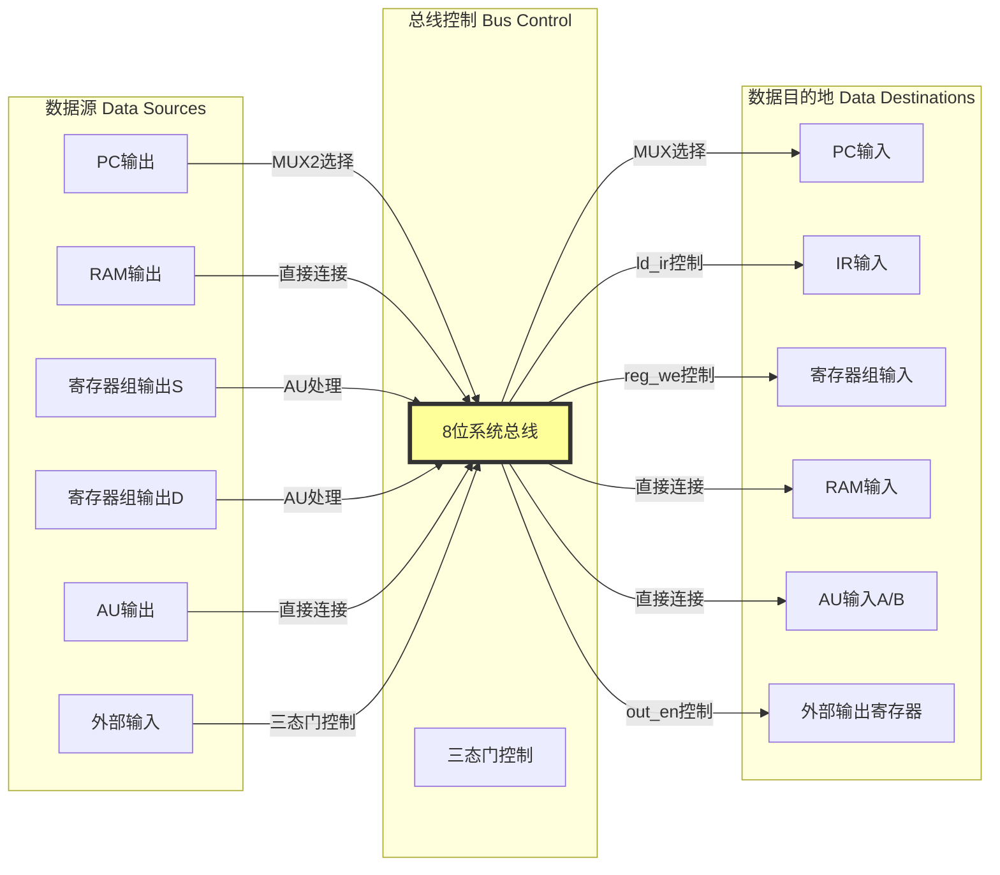
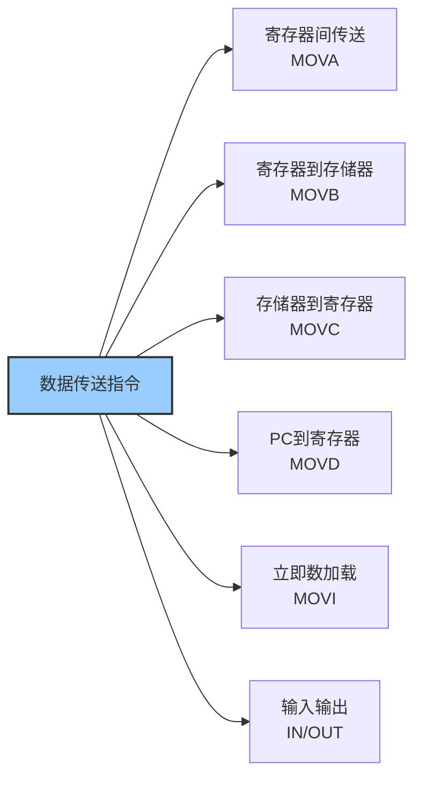
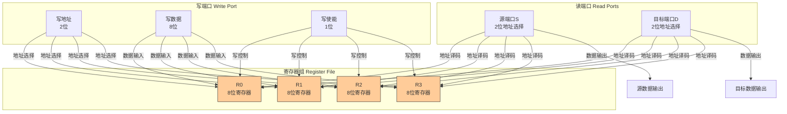
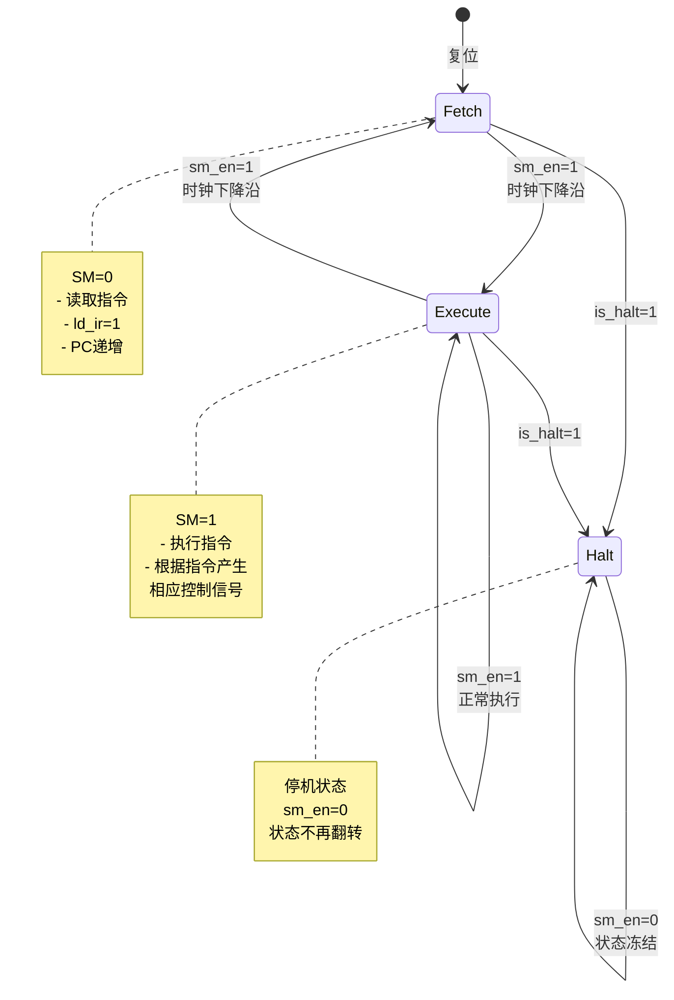
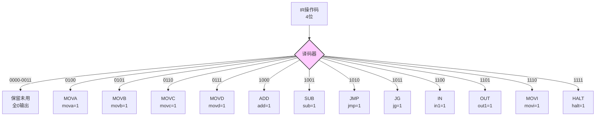
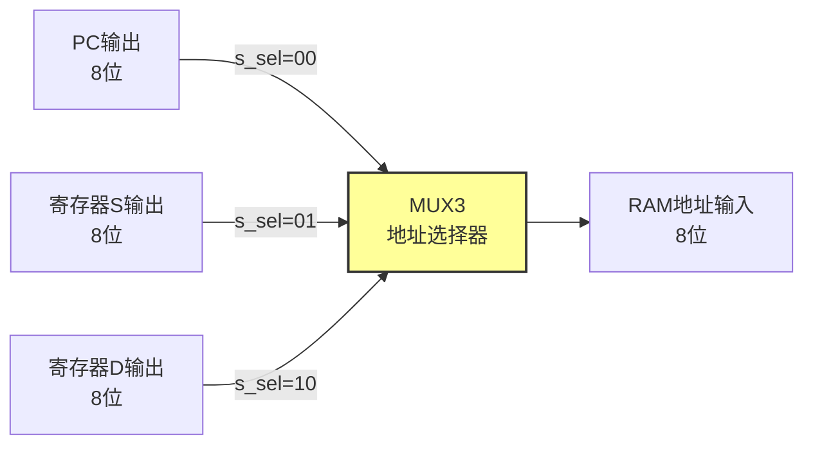
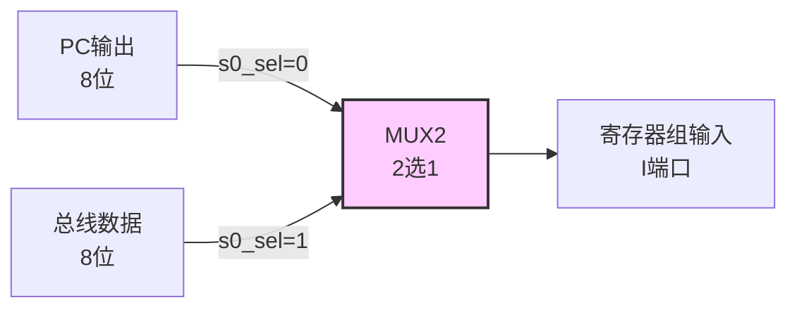
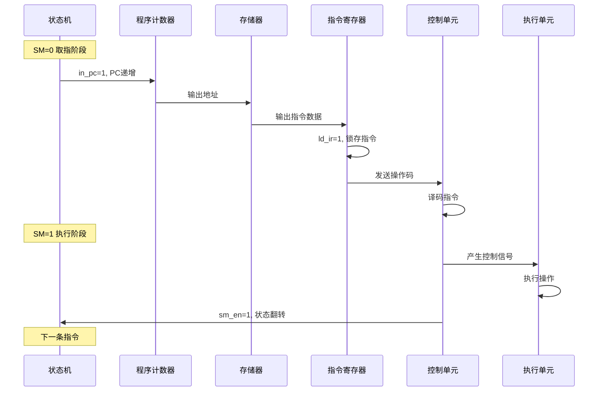
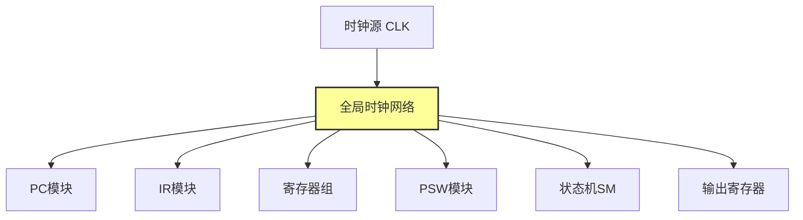

# 8位模型机设计文档

## 摘要

本文档详细阐述了一款基于冯·诺依曼架构的8位模型机的完整设计方案。该模型机采用Verilog HDL硬件描述语言实现，具备完整的指令系统、数据通路和控制单元设计。系统支持12条基本指令，包含数据传送、算术运算、程序控制和输入输出等功能模块，可作为计算机组成原理课程的教学实践平台。

---

## 1. 设计概述

本8位模型机的设计旨在为计算机组成原理课程提供一个结构清晰、功能完整且易于理解的硬件实践平台。设计团队在项目初期确立了四个核心设计目标：首先是教学示范性，要求系统能够清晰展示计算机体系结构的核心概念，包括指令系统的设计原理、数据通路的构建方法以及控制单元的工作机制；其次是结构完整性，确保CPU的所有关键功能模块都能得到实现，并构成一个可执行的完整指令系统；第三是可扩展性，通过模块化的设计方法，使得后续的功能增强和性能优化能够以最小的改动成本实现；最后是工程实践性，要求整个设计能够基于FPGA平台进行实际的硬件验证和调试，从而为学生提供从理论到实践的完整学习路径。

在系统规格参数的确定过程中，设计团队充分考虑了教学需求与实现复杂度的平衡。系统采用8位数据位宽，这既符合经典计算机体系结构的教学传统，又能在现代FPGA资源约束下实现较高的时钟频率。256字节的地址空间通过8位地址总线实现，虽然容量有限，但足以支撑教学演示程序的运行。寄存器文件包含4个8位通用寄存器（R0-R3），提供了足够的操作数存储空间。指令系统包含12条指令，涵盖了数据传送、算术运算、程序控制和输入输出等基本操作类型。时钟系统采用同步时序设计，所有时序逻辑元件均在时钟下降沿触发，这种设计选择不仅简化了时序分析，还与大多数FPGA内嵌存储器的接口时序保持一致。存储器组织采用哈佛架构的变体形式，程序指令和数据共享同一个RAM空间，这种设计在简化地址选择逻辑的同时，也体现了冯·诺依曼架构的核心特征。

整个系统设计遵循一系列严谨的设计原则。简洁性原则要求设计方案尽可能采用最简化的实现方式，突出核心概念而非复杂的优化技巧，这使得学生能够专注于理解计算机的基本工作原理而非被复杂的工程细节所困扰。模块化原则体现在每个功能单元的独立设计上，通过明确定义的接口降低模块间的耦合度，这不仅便于教学演示时的分模块讲解，也为后续的功能扩展提供了便利。同步设计原则强制使用统一的时钟信号，所有寄存器操作都在时钟边沿完成，这种设计有效避免了异步时序电路中常见的竞争冒险问题，提高了系统的可靠性。可观测性原则要求在顶层模块预留充分的测试信号接口，包括总线数据、程序计数器值、指令寄存器内容和状态机状态等关键信号，这些测试点为硬件调试和教学演示提供了必要的观测手段。

---

## 2. 整体架构设计

### 2.1 系统总体架构

本模型机采用经典的单总线架构设计，所有功能模块通过一条8位宽的内部总线进行数据交换，这种设计在硬件资源消耗和控制复杂度之间取得了良好的平衡。从功能划分的角度来看，系统主要由四个核心子系统构成：控制单元负责指令译码和时序控制，运算单元执行算术和逻辑操作，存储单元提供程序和数据的存储空间，而I/O接口则实现与外部环境的交互。

控制单元作为整个系统的指挥中心，由控制单元核心逻辑、状态机和指令译码器三个组件协同工作。状态机维护系统的执行状态，通过取指和执行两个状态的交替切换，实现指令的周期性执行流程。指令译码器接收指令寄存器的高4位操作码，将其转换为12个独立的指令识别信号，这些信号与状态信号共同驱动控制单元核心逻辑产生最终的控制信号。

运算单元包含程序计数器、指令寄存器、寄存器文件、算术逻辑单元和程序状态字五个关键组件。程序计数器存储下一条待执行指令的地址，支持装载和递增两种操作模式。指令寄存器在取指阶段锁存从存储器读出的指令，并将其分段为操作码和操作数字段供后续阶段使用。寄存器文件提供4个8位通用寄存器，采用双端口读出、单端口写入的结构，支持同时读取两个操作数。算术逻辑单元执行加法、减法和数据传送操作，并根据运算结果生成状态标志。程序状态字保存运算过程中的状态信息，当前仅实现大于标志用于条件跳转控制。

存储单元采用256字节的RAM模块，通过三选一多路选择器选择存储器地址源。地址选择器的三个输入分别来自程序计数器（用于取指阶段）、源寄存器（用于MOVC指令）和目标寄存器（用于MOVB指令），这种设计使得存储器能够在不同指令阶段服务于不同的数据访问需求。

I/O接口采用三态门实现的输入通道和寄存器锁存的输出通道。输入接口仅在IN指令执行期间将外部数据驱动到总线上，其他时间保持高阻态以释放总线资源。输出接口通过一个专门的寄存器锁存OUT指令写入的数据，确保输出值在指令执行结束后仍能保持稳定。

### 2.2 数据通路设计

数据通路是计算机中数据流动的物理路径，本设计采用单总线结构具有显著的教学优势。单总线架构的核心特征是所有数据源和数据目的地都连接到同一条共享总线上，通过精确的时序控制和三态门管理来避免数据冲突。这种结构虽然在性能上不如多总线架构，但其简洁性使得数据流动路径清晰可见，便于学生理解计算机内部的数据传输机制。

在本设计中，数据通路的组成要素包括多个数据源和多个数据目的地。数据源主要包括程序计数器的输出、寄存器组的源端口输出、算术逻辑单元的运算结果以及外部输入设备。这些数据源通过各自的输出控制逻辑连接到总线，只有在相应控制信号有效时才会驱动总线。数据目的地包括程序计数器的输入、指令寄存器的输入、寄存器组的写入端口、存储器的数据输入以及算术逻辑单元的两个操作数输入。

总线控制采用三态门机制来实现多源共享。当某个模块需要向总线发送数据时，相应的三态门被使能，其他模块的三态门则处于高阻态。这种机制要求控制信号的产生必须严格遵循时序约束，确保在任何时刻只有一个数据源驱动总线，避免总线冲突。同时，对于某些特殊场景，如输入操作，总线可能需要在特定时间段内由外部设备驱动，这就要求控制逻辑能够精确协调内部和外部驱动源的切换。

时序控制是数据通路正常工作的关键。系统采用同步设计，所有寄存器在时钟下降沿采样输入数据。在一个完整的指令周期内，数据通路需要经历两个不同的阶段：取指阶段和执行阶段。在取指阶段，程序计数器的值通过地址选择器送到存储器地址端口，存储器读出的指令数据通过总线加载到指令寄存器中，同时程序计数器递增。在执行阶段，根据指令类型，数据可能在寄存器文件、算术逻辑单元、存储器和I/O接口之间流动，最终的结果被写回到目标位置。

### 2.3 控制单元设计

控制单元是整个系统的神经中枢，负责根据当前指令和系统状态产生所有必要的控制信号。本设计采用硬布线控制方式，即控制信号完全由组合逻辑电路产生，不使用微程序控制。这种选择基于教学目的考虑，硬布线控制的逻辑关系直观明确，便于学生理解控制信号的产生原理。

控制单元的输入信号包括状态机状态（sm）、指令操作码（ir_opcode[3:0]）和程序状态字的标志位（psw_g）。状态信号指示当前处于取指阶段还是执行阶段，这直接影响大多数控制信号的有效性。操作码字段来自指令寄存器的高4位，经过指令译码器转换为12个独立的指令识别信号。标志位信号提供条件跳转的判断依据，仅在执行条件跳转指令时被查询。

控制单元的输出信号涵盖了CPU所有功能模块的控制需求。程序计数器控制包括装载信号（ld_pc）和递增信号（in_pc），这两个信号的组合决定了PC的操作模式。指令寄存器控制仅有一个装载信号（ld_ir），在取指阶段有效。寄存器文件控制包括写使能信号（reg_we）和源寄存器选择信号（s_sel），其中s_sel还用于存储器地址选择。存储器控制包括写使能（ram_we）和读使能（ram_re）信号。算术逻辑单元控制仅有一个使能信号（au_en），用于控制AU是否输出有效数据。程序状态字控制包括标志位写使能（g_en），仅在减法指令时有效。I/O控制包括输入使能（in_en）和输出使能（out_en）信号。

控制信号的产生逻辑遵循严格的布尔表达式。例如，ld_pc信号在执行阶段且遇到跳转指令（JMP或条件跳转且条件满足）时有效；in_pc信号在取指阶段总是有效，或在执行阶段遇到MOVI指令时有效；reg_we信号在执行阶段且遇到需要写寄存器的指令时有效。这些逻辑关系体现了指令的精确语义，确保每个指令都能产生正确的操作序列。

---

## 3. 指令系统设计

### 3.1 指令格式与编码

本系统采用固定长度的指令格式，每条指令占用一个字节，这种设计简化了指令获取和译码过程。指令字节被划分为两个4位字段：高4位为操作码字段，低4位为操作数/地址码字段。操作码字段定义指令类型，支持最多16种指令，实际使用了12种。操作数字段的含义根据指令类型而变化，可能表示源寄存器编号、目标寄存器编号、寻址模式信息或立即数值。

指令编码表的设计体现了系统功能的完整性和编码的规律性。数据传送指令使用0100到0111的操作码范围，涵盖了寄存器间传送、寄存器到存储器、存储器到寄存器以及PC到寄存器四种基本传送操作。算术运算指令使用1000和1001，分别对应加法和减法操作。程序控制指令使用1010和1011，实现无条件跳转和条件跳转。输入输出指令使用1100和1101，分别对应输入和输出操作。立即数加载指令使用1110，而停机指令使用1111。未使用的操作码0000到0011保留为未来扩展。

### 3.2 指令分类与功能

根据功能特点，12条指令可以分为四个主要类别。数据传送指令包含6条，构成了指令系统的基础。MOVA指令实现寄存器间的直接数据传送，源寄存器和目标寄存器由指令低4位的两个2位字段指定。MOVB指令将寄存器数据写入存储器，使用目标寄存器的值作为存储器地址，源寄存器提供写入数据。MOVC指令从存储器读取数据到寄存器，使用源寄存器的值作为存储器地址。MOVD指令特殊之处在于将程序计数器的当前值传送到寄存器，这为程序提供了获取当前位置的能力。MOVI指令支持立即数加载，它需要两个指令周期，第一个周期获取指令，第二个周期从PC指向的地址读取立即数并写入目标寄存器，同时PC再次递增。输入输出指令通过三态门和输出寄存器实现与外部设备的数据交换。

算术运算指令包含加法和减法两条。ADD指令执行无符号加法，结果写回目标寄存器，不设置任何标志位。SUB指令执行减法运算，结果同样写回目标寄存器，但会根据运算结果设置程序状态字中的G标志。G标志的置位条件是被减数大于减数，这里采用有符号数比较，即当Rs > Rd时G=1。这个标志为条件跳转指令提供了判断依据。

程序控制指令包含无条件跳转和条件跳转。JMP指令将程序计数器设置为源寄存器的值，实现程序流程的无条件转移。JG指令检查G标志，仅当G=1时才执行跳转操作，否则继续顺序执行。这种条件跳转机制支持基本的程序分支结构。

系统控制指令目前仅包含HALT指令，执行该指令时控制单元会将状态机使能信号置零，阻止状态机继续翻转，从而使CPU停止执行。这种停机机制为程序结束提供了明确的标识。

---

## 4. 功能模块详细设计

### 4.1 程序计数器（PC）

程序计数器是CPU中用于存储下一条待执行指令地址的关键寄存器。在本设计中，PC是一个8位寄存器，支持两种操作模式：装载模式和递增模式。装载模式用于实现程序跳转，当ld_pc信号有效且in_pc信号无效时，PC在时钟下降沿采样输入数据a的值。递增模式用于顺序执行，当in_pc信号有效且ld_pc信号无效时，PC在时钟下降沿执行加1操作。当两个控制信号都无效时，PC保持当前值不变。

PC的初始值被设置为0x00，这确保程序从存储器的起始位置开始执行。在实际执行过程中，PC的值会根据指令类型和执行阶段发生变化。在取指阶段，PC总是递增，指向下一个指令地址。在执行阶段，如果遇到跳转指令且跳转条件满足，PC会被装载为跳转目标地址。对于MOVI指令，PC在执行阶段也会递增，用于获取立即数。

### 4.2 指令寄存器（IR）

指令寄存器用于在指令执行期间保存当前指令的内容。它是一个8位寄存器，在取指阶段的末尾锁存从存储器读出的指令数据。IR的装载由ld_ir信号控制，该信号仅在取指阶段有效，确保每个指令周期只装载一次新指令。

IR的内容被后续逻辑分段使用。高4位（IR[7:4]）作为操作码送入指令译码器，产生各种指令识别信号。低4位进一步划分为两个2位字段：IR[3:2]作为目标寄存器编号（DR），IR[1:0]作为源寄存器编号（SR）。这种固定的字段划分简化了寄存器选择逻辑，但需要注意某些特殊指令需要对这种默认解释进行调整。

### 4.3 寄存器组（Register File）

寄存器组包含4个8位通用寄存器R0-R3，采用双端口读出、单端口写入的结构设计。读端口包括源端口S和目标端口D，分别由2位地址信号sr和dr选择。写端口由dr地址和写使能信号we控制，在时钟下降沿将输入数据i写入指定的寄存器。

寄存器的初始值经过精心设计以支持测试程序的运行。R0初始化为0x01，用作数据访问的地址指针。R1和R2初始化为0x00，作为临时数据寄存器。R3初始化为0x07，用作跳转目标地址。这种初始化配置使得测试程序能够演示各种指令的功能。

寄存器读操作采用组合逻辑实现，读地址的任何变化都会立即反映在输出端口上，这满足了执行阶段对操作数的实时需求。写操作是时序逻辑，在时钟下降沿完成，确保数据的稳定写入。这种读写分离的设计避免了数据冲突，支持在一个时钟周期内完成读取操作数和写入结果的操作。

### 4.4 算术逻辑单元（AU）

算术逻辑单元是执行算术运算和数据传送的核心组件。它接收两个8位输入a和b，根据4位操作码ac执行相应的操作，输出8位结果t和1位状态标志gf。AU的工作由使能信号au_en控制，当au_en=0时，输出保持高阻态，释放总线资源。

AU支持三种类型的操作。加法操作对应操作码1000，执行t = a + b，不设置标志位。减法操作对应操作码1001，执行t = b - a，同时根据有符号数比较结果设置gf标志。当b > a时gf=1，否则gf=0。数据传送操作对应操作码0100、0101和1101，执行t = a，不设置标志位。这些操作码分别对应MOVA、MOVB和OUT指令，它们都需要将源数据传送到总线上。

### 4.5 程序状态字（PSW）

程序状态字用于保存运算过程中的状态信息，当前仅实现G标志（大于标志）。G标志是一个1位寄存器，由g_en信号控制更新。当g_en=1时，在时钟下降沿将AU产生的gf信号值锁存到PSW中。当g_en=0时，PSW保持当前值不变。

G标志的语义定义为：当最近执行的SUB指令中被减数大于减数时，G=1，否则G=0。这个标志为条件跳转指令JG提供了判断依据。需要注意的是，只有SUB指令会更新G标志，其他指令不会改变G标志的值，这确保了标志位的语义一致性。

### 4.6 状态机（SM）

状态机控制CPU的工作流程，实现取指-执行的周期性操作。它是一个1位寄存器，初始值为0（取指状态）。状态转换由sm_en信号控制，当sm_en=1时，在时钟下降沿状态翻转；当sm_en=0时，状态保持不变。

状态机的两个状态具有明确的语义。状态0表示取指阶段，在此阶段系统执行以下操作：IR装载使能，PC递增，存储器读使能，地址选择器选择PC输出。状态1表示执行阶段，在此阶段系统根据当前指令执行相应的操作，包括寄存器写入、存储器写入、算术运算、I/O操作等。

当执行HALT指令时，控制单元将sm_en置零，状态机停止翻转，CPU进入停机状态。这种停机机制为程序提供了明确的终止条件。

### 4.7 指令译码器（Instruction Decoder）

指令译码器将4位操作码转换为12个独立的指令识别信号。它是一个纯组合逻辑电路，当使能信号en=1时，根据输入的4位操作码产生相应的输出信号。当en=0时，所有输出均为0。

译码器采用一一对应的译码方式。操作码0100产生mova=1，0101产生movb=1，依此类推，直到1111产生halt=1。未使用的操作码0000到0011不产生任何有效输出，保持所有识别信号为0。这种设计确保了指令系统的可扩展性，未来可以轻松添加新的指令。

### 4.8 存储器（RAM）

存储器模块提供256字节的存储空间，用于存储程序指令和数据。它采用Altera的LPM RAM库函数实现，配置为8位数据宽度、8位地址宽度、256个存储单元。存储器的初始化文件ram_init.mif定义了初始存储内容，包括测试程序和初始数据。

存储器的读写操作由we（写使能）和outenab（输出使能）信号控制。当we=1时，在时钟上升沿将总线上的数据写入指定地址。当outenab=1时，指定地址的数据被输出到总线上。存储器的地址通过三选一多路选择器选择，支持PC地址、源寄存器地址和目标寄存器地址三种来源。

### 4.9 多路选择器（MUX）

系统包含两个多路选择器：MUX2和MUX3。MUX2是一个2选1选择器，用于选择寄存器文件的输入数据源。当s0_sel=0时选择PC输出，用于MOVD指令；当s0_sel=1时选择总线数据，用于其他所有需要写寄存器的指令。

MUX3是一个3选1选择器，用于选择存储器的地址源。当s_sel=00时选择PC输出，用于取指阶段；当s_sel=01时选择源寄存器输出，用于MOVC指令；当s_sel=10时选择目标寄存器输出，用于MOVB指令。默认情况下选择PC输出。

---

## 5. 指令执行流程

### 5.1 指令周期概述

本模型机采用两级指令周期设计，每个指令周期包含取指阶段和执行阶段，每个阶段占用一个时钟周期。这种设计使得指令的获取和执行在时间上分离，便于控制逻辑的设计和时序分析。

在取指阶段（SM=0），系统执行以下操作序列：首先，地址选择器选择PC输出作为存储器地址，存储器读使能信号有效，从指定地址读取指令数据。同时，PC递增，为下一条指令做准备。读出的指令数据通过总线传输到指令寄存器，在时钟下降沿被锁存。指令的高4位被送入指令译码器，产生相应的指令识别信号。取指阶段结束时，状态机翻转到执行阶段。

在执行阶段（SM=1），系统根据当前指令的类型执行相应的操作。控制单元根据指令识别信号和状态信号产生所有必要的控制信号，协调各功能模块完成指令语义。执行阶段可能涉及寄存器读写、存储器访问、算术运算、I/O操作等。执行阶段结束时，如果当前指令不是HALT指令，状态机翻转回取指阶段，开始下一个指令周期。

### 5.2 典型指令的执行细节

MOVA指令（寄存器间传送）的执行过程体现了单总线架构的数据流动特点。在执行阶段，源寄存器的值通过AU（此时AU配置为直通模式）传输到总线上，同时寄存器写使能信号有效，目标寄存器在时钟下降沿锁存总线上的数据。整个过程在一个时钟周期内完成，数据从源寄存器流出，经过AU和总线，最终流入目标寄存器。

MOVB指令（寄存器到存储器）需要协调存储器写操作。在执行阶段，目标寄存器的值被送到地址选择器，选择器输出作为存储器地址。同时，源寄存器的值通过AU传输到总线上，存储器写使能信号有效，在时钟上升沿将总线数据写入指定地址。这里需要注意存储器写操作的时序：地址和数据在时钟上升沿之前必须稳定，而写使能信号也在时钟上升沿采样。

MOVC指令（存储器到寄存器）执行存储器读操作。在执行阶段，源寄存器的值作为存储器地址，存储器读使能有效，读出的数据通过总线传输到寄存器文件的输入端。同时寄存器写使能有效，在时钟下降沿将数据写入目标寄存器。这里体现了存储器读操作和寄存器写操作的配合。

MOVD指令（PC到寄存器）相对简单。在执行阶段，PC的当前值通过MUX2选择器送到寄存器文件输入端，寄存器写使能有效，在时钟下降沿写入目标寄存器。这个指令为程序提供了获取当前位置的能力，可用于位置无关代码的实现。

MOVI指令（立即数加载）需要两个存储器访问周期。第一个周期是正常的取指周期，获取MOVI指令本身。第二个周期在执行阶段，PC的值作为地址再次访问存储器，读取立即数数据。同时PC在执行阶段也会递增，为后续指令做准备。这种设计使得MOVI指令占用两个时钟周期，但保持了指令格式的简洁性。

ADD指令（加法运算）在执行阶段激活算术逻辑单元。源寄存器和目标寄存器的值分别作为AU的两个输入，AU执行加法运算并将结果输出到总线上。同时寄存器写使能有效，在时钟下降沿将运算结果写回目标寄存器。整个加法过程在一个周期内完成。

SUB指令（减法运算）的执行过程与ADD类似，但会同时更新程序状态字。AU执行减法运算，结果输出到总线并写回目标寄存器。同时，AU根据有符号数比较结果产生gf信号，g_en信号有效，在时钟下降沿将gf值锁存到PSW中。这个标志位将影响后续的条件跳转指令。

JMP指令（无条件跳转）在执行阶段修改程序计数器。源寄存器的值通过AU传输到总线，ld_pc信号有效，PC在时钟下降沿锁存总线上的值，实现程序跳转。跳转后，下一条指令将从新的PC地址开始执行。

JG指令（条件跳转）需要检查G标志。在执行阶段，控制单元查询PSW的G标志值。如果G=1，则ld_pc信号有效，PC装载源寄存器的值，实现跳转。如果G=0，则ld_pc无效，PC保持不变，程序继续顺序执行。

IN指令（输入）在执行阶段激活输入接口。in_en信号有效，三态门将外部输入数据驱动到总线上。同时寄存器写使能有效，在时钟下降沿将总线数据写入目标寄存器。输入数据在时钟下降沿之前必须稳定。

OUT指令（输出）在执行阶段激活输出接口。源寄存器的值通过AU传输到总线上，out_en信号有效，输出寄存器在时钟下降沿锁存总线上的数据，并将其输出到外部设备。输出寄存器的设计确保了输出值的稳定性，即使总线后续发生变化，输出值仍保持不变。

HALT指令（停机）在执行阶段将sm_en信号置零，阻止状态机继续翻转。此后，CPU将保持在当前状态，不再执行新的指令，直到外部复位信号重新初始化系统。

---

## 6. 控制信号详解

### 6.1 信号分类与功能

控制信号可以根据其控制的对象分为多个类别。程序计数器控制信号包括ld_pc和in_pc，它们共同决定了PC的操作模式。指令寄存器控制信号ld_ir控制指令的装载。寄存器文件控制信号包括reg_we和s_sel，前者控制写操作，后者用于特殊指令的寄存器选择调整。存储器控制信号包括ram_we、ram_re和s_sel（地址选择），其中s_sel与寄存器文件共用。算术逻辑单元控制信号au_en控制AU的输出。程序状态字控制信号g_en控制标志位更新。I/O控制信号包括in_en和out_en。

### 6.2 信号产生逻辑的详细分析

ld_pc信号的产生逻辑体现了跳转指令的执行条件。表达式为：ld_pc = sm & (is_jmp | (is_jg & psw_g))。这个逻辑确保只有在执行阶段（sm=1）且遇到跳转指令时，ld_pc才可能有效。对于JMP指令，无条件产生装载信号。对于JG指令，只有当G标志为1时才产生装载信号。这种设计确保了跳转操作的精确控制。

in_pc信号的产生相对复杂，需要支持两种不同的递增场景。表达式为：in_pc = (~sm) | (sm & is_movi)。在取指阶段（~sm=1），PC总是递增，这是顺序执行的基础。在执行阶段，只有MOVI指令需要PC递增，用于获取立即数。这种双重递增机制确保了指令序列的正确推进。

reg_we信号的产生涉及多种需要写寄存器的指令。表达式为：reg_we = sm & (is_mova | is_movc | is_movd | is_movi | is_add | is_sub | is_in)。这个逻辑确保只有在执行阶段且遇到需要写寄存器的指令时，写使能才有效。需要注意的是，MOVB和OUT指令不需要写寄存器，因此不包含在表达式中。

ram_we信号专门用于MOVB指令，表达式为：ram_we = sm & is_movb。这确保只有在执行阶段执行MOVB指令时，存储器写操作才会发生。

ram_re信号需要支持多个读存储器的场景。表达式为：ram_re = (~sm) | (sm & (is_movc | is_movi))。在取指阶段，存储器读总是使能，用于获取指令。在执行阶段，MOVC和MOVI指令需要读取存储器，因此读使能有效。

au_en信号控制算术逻辑单元的输出。表达式为：au_en = sm & (is_mova | is_movb | is_out | is_add | is_sub)。这些指令都需要通过AU传输数据或执行运算，因此在执行阶段需要使能AU。

g_en信号仅在SUB指令时有效，表达式为：g_en = sm & is_sub。这确保只有减法运算会更新G标志，其他运算不会影响标志位的值。

in_en和out_en信号分别在IN和OUT指令执行时有效，表达式分别为：in_en = sm & is_in 和 out_en = sm & is_out。这些信号控制I/O接口的激活。

s_sel信号用于存储器地址选择，需要支持三种不同的地址来源。表达式为：s_sel[1] = sm & is_movb 和 s_sel[0] = sm & is_movc。当执行MOVB指令时，s_sel=10，选择目标寄存器输出作为地址。当执行MOVC指令时，s_sel=01，选择源寄存器输出作为地址。其他情况下s_sel=00，选择PC输出作为地址。

s0_sel信号用于寄存器数据源选择，表达式为：s0_sel = ~(sm & is_movd)。当执行MOVD指令时，s0_sel=0，选择PC输出作为寄存器输入。对于其他所有需要写寄存器的指令，s0_sel=1，选择总线数据作为寄存器输入。

---

## 7. 时序设计

### 7.1 时钟策略与触发方式

系统采用统一的时钟源，所有时序逻辑元件都在时钟下降沿触发。这种设计选择基于多个考虑因素。首先，下降沿触发与大多数FPGA内嵌存储器的接口时序兼容，这些存储器通常在时钟上升沿完成写操作，在下降沿可以稳定读出数据。其次，下降沿触发为组合逻辑提供了更长的稳定时间，从时钟下降沿开始，组合逻辑有几乎整个时钟周期的时间来计算结果，直到下一个下降沿被锁存。第三，这种设计简化了时序分析，因为所有寄存器的更新都在同一个边沿完成。

时钟频率的选择需要考虑多个因素。组合逻辑的最长路径延迟必须小于时钟周期减去寄存器的建立时间。在本设计中，关键路径包括从指令译码到控制信号产生的路径，以及从寄存器读出到算术逻辑单元输出的路径。考虑到教学目的和FPGA的典型性能，建议时钟频率不超过50MHz，对应的时钟周期为20ns。

### 7.2 关键时序路径分析

取指阶段的时序关系涉及多个操作的协调。在时钟下降沿，PC递增操作完成，新的PC值稳定输出。随后，地址选择器选择PC输出，经过短暂的组合逻辑延迟后，存储器地址端口获得有效地址。存储器需要一定的时间来访问指定地址的内容，读出的数据需要在总线上稳定。在下一个时钟下降沿之前，指令数据必须已经稳定在总线上，以便指令寄存器能够正确锁存。

执行阶段的时序更加复杂，因为涉及多种可能的操作。对于寄存器读操作，读地址在执行阶段开始时就已确定，寄存器的读出是组合逻辑，几乎立即有效。对于算术运算，两个操作数从寄存器读出后，经过AU的组合逻辑处理，产生运算结果。对于存储器写操作，地址和数据需要在时钟上升沿之前稳定，写使能信号也需要在上升沿有效。对于寄存器写操作，写入的数据需要在时钟下降沿之前稳定在寄存器输入端口。

### 7.3 时序约束与可靠性设计

为确保设计的可靠性，需要考虑建立时间和保持时间的要求。建立时间是数据在时钟边沿之前必须稳定的时间，保持时间是数据在时钟边沿之后必须保持稳定的时间。在本设计中，所有寄存器的输入数据路径都需要满足这些时序要求。

对于关键路径，如从寄存器读出到算术逻辑单元输出再到总线的路径，需要确保组合逻辑延迟加上寄存器保持时间小于时钟周期。如果路径过长，可能需要插入流水线寄存器或降低时钟频率。在教学环境中，通常选择较低的时钟频率以确保可靠性。

系统的复位设计也需要考虑时序。复位信号需要在时钟边沿之前有效，并保持足够长的时间，确保所有寄存器都能正确初始化。本设计中，复位信号初始化PC、IR、PSW和SM为已知状态，寄存器文件也通过initial语句初始化。

---

## 8. 测试与验证

### 8.1 测试策略

系统的测试采用多层次的验证方法。首先是模块级测试，每个功能模块都有独立的测试验证其基本功能。其次是集成测试，通过Testbench将所有模块连接起来，运行完整的测试程序。最后是硬件验证，在FPGA平台上运行测试程序，通过实际的硬件行为验证设计的正确性。

测试程序的设计遵循从简单到复杂的原则。测试程序包含多种指令类型，覆盖了指令系统的主要功能。程序从地址00开始执行，首先通过JMP指令跳转到程序主体，然后依次执行输入、数据传送、算术运算、条件跳转、存储器访问、立即数加载、输出等操作，最后以HALT指令结束。这种测试覆盖了指令系统的所有关键路径。

### 8.2 仿真验证

仿真测试通过Testbench实现，提供时钟信号和输入数据，并监控关键信号的变化。Testbench在每个时钟周期的上升沿打印系统状态，包括PC值、IR值、状态机状态、寄存器值、总线值和输出值。这种详细的跟踪信息有助于分析指令执行的正确性。

仿真过程中需要关注的关键点包括：指令是否正确读取，寄存器写入是否在正确的时钟边沿发生，算术运算结果是否正确，条件跳转是否根据标志位正确执行，存储器读写是否正确，I/O操作是否正确，以及停机指令是否有效阻止后续指令执行。

### 8.3 硬件验证

在FPGA平台上验证时，需要将设计综合并下载到目标器件。验证方法包括：使用LED显示输出结果，通过逻辑分析仪捕获关键信号的时序波形，以及降低时钟频率进行单步调试。硬件验证的重点是确认设计在实际物理器件中的行为与仿真结果一致，特别是时序特性和信号完整性。

---

## 9. 设计总结

### 9.1 设计特点

本8位模型机设计体现了教学导向的工程设计理念。结构简洁性使得学生能够专注于核心概念的理解，而不被复杂的工程细节所困扰。功能完整性确保了设计能够演示计算机体系结构的所有关键方面。模块化设计不仅便于教学演示，也为后续的功能扩展提供了便利。可观测性原则的应用使得调试和演示变得直观有效。

### 9.2 技术创新点

在控制逻辑设计上，采用硬布线控制方式，所有控制信号由组合逻辑直接产生，避免了微程序控制的复杂性。在数据通路设计上，单总线结构虽然在性能上有所妥协，但大大简化了控制逻辑，使得数据流动路径清晰可见。在时序设计上，统一的下降沿触发策略简化了时序分析，并与FPGA的存储器接口保持兼容。

### 9.3 教学价值

该设计为计算机组成原理课程提供了一个理想的教学平台。学生可以通过分析Verilog代码理解每个模块的功能和实现细节，通过仿真观察指令执行的完整过程，通过硬件验证体验从设计到实现的完整工程流程。设计中体现的模块化思想、接口设计原则、时序控制方法等都是计算机系统设计的核心概念。

### 9.4 扩展可能性

当前设计为未来扩展预留了充分的空间。未使用的操作码可以用于添加新的算术逻辑指令，如逻辑运算、移位操作等。寄存器文件可以扩展到更多寄存器，或增加专门的地址寄存器。可以添加中断系统、堆栈支持、更复杂的标志位等高级特性。单总线架构也可以演变为多总线架构以提升性能。这些扩展都可以在保持核心设计理念的基础上逐步实现。

---

## 附录A：术语表

| 术语 | 英文全称 | 中文说明 |
|------|---------|---------|
| PC | Program Counter | 程序计数器，存储下一条指令地址 |
| IR | Instruction Register | 指令寄存器，存储当前指令 |
| AU | Arithmetic Unit | 算术逻辑单元，执行运算操作 |
| PSW | Program Status Word | 程序状态字，存储标志位 |
| SM | State Machine | 状态机，控制CPU工作状态 |
| RAM | Random Access Memory | 随机存取存储器 |
| MUX | Multiplexer | 多路选择器 |
| FPGA | Field Programmable Gate Array | 现场可编程门阵列 |
| HDL | Hardware Description Language | 硬件描述语言 |
| RTL | Register Transfer Level | 寄存器传输级 |

---

## 附录B：参考文献

1. Patterson, D. A., & Hennessy, J. L. (2017). *Computer Organization and Design RISC-V Edition*. Morgan Kaufmann.
2. Harris, D. M., & Harris, S. L. (2012). *Digital Design and Computer Architecture*. Morgan Kaufmann.
3. Wakerly, J. F. (2005). *Digital Design: Principles and Practices*. Prentice Hall.
4. Intel Corporation. (2023). *Quartus Prime User Guide*.

---

**文档信息**

- **文档版本**：V1.0
- **编写日期**：2026年1月
- **适用对象**：计算机组成原理课程设计
- **文档类型**：系统设计说明书
- **编写语言**：中文
- **项目名称**：8位模型机设计

---

**版权声明**

本文档仅用于教学目的，不得用于商业用途。部分设计参考了相关教材和课程资料，版权归原作者所有。

### 2.2 数据通路设计

数据通路是计算机中数据流动的路径，本设计采用**单总线结构**，具有以下特点：

#### 2.2.1 单总线架构优势

1. **结构简单**：只需一套总线，减少硬件复杂度
2. **易于控制**：数据流动路径清晰，便于控制信号设计
3. **成本较低**：减少连线和布线资源

#### 2.2.2 数据通路组成要素



**图2 数据通路详细连接图**

#### 2.2.3 总线时序控制

系统采用**同步时序**设计，所有寄存器在时钟下降沿触发：

```
时钟周期示意：
    ┌───┐   ┌───┐   ┌───┐   ┌───┐
CLK │   │   │   │   │   │   │   │
    └───┘   └───┘   └───┘   └───┘
      ↓       ↓       ↓       ↓
    取指    执行    取指    执行
    SM=0    SM=1    SM=0    SM=1
```

**图3 系统时序图**

每个指令周期分为两个阶段：
- **取指阶段（SM=0）**：从RAM读取指令到IR
- **执行阶段（SM=1）**：执行指令操作

---

### 2.3 控制单元设计

控制单元是CPU的指挥中心，负责产生所有控制信号。本设计采用**硬布线控制**方式。

#### 2.3.1 控制单元结构

```mermaid
graph TD
    A[输入信号] --> B[控制单元核心]
    B --> C[输出控制信号]

    A --> A1[状态机SM<br/>sm: 0/1]
    A --> A2[指令操作码<br/>ir_opcode[3:0]]
    A --> A3[状态标志<br/>psw_g]

    C --> C1[PC控制信号<br/>ld_pc, in_pc]
    C --> C2[IR控制信号<br/>ld_ir]
    C --> C3[寄存器控制<br/>reg_we]
    C --> C4[存储器控制<br/>ram_we, ram_re]
    C --> C5[AU控制信号<br/>au_en]
    C --> C6[PSW控制信号<br/>g_en]
    C --> C7[I/O控制信号<br/>in_en, out_en]
    C --> C8[MUX选择信号<br/>s_sel, s0_sel]

    style B fill:#f96,stroke:#333,stroke-width:2px
```

**图4 控制单元输入输出关系**

#### 2.3.2 控制信号产生逻辑

控制信号的产生遵循以下原则：

```verilog
// 伪代码示例：控制信号生成逻辑
// 基于状态、指令和标志的组合逻辑

always @(*) begin
    // PC控制
    ld_pc = sm && (is_jmp || (is_jg && psw_g));  // 跳转时加载
    in_pc = !sm || (sm && is_movi);               // 取指或MOVI时递增

    // 寄存器写使能
    reg_we = sm && (is_mova || is_movc || is_movd ||
                    is_movi || is_add || is_sub || is_in);

    // 存储器读写
    ram_we = sm && is_movb;     // MOVB指令写RAM
    ram_re = !sm || (sm && (is_movc || is_movi));  // 取指/MOVC/MOVI读RAM

    // AU控制
    au_en = sm && (is_mova || is_movb || is_out || is_add || is_sub);

    // PSW标志更新
    g_en = sm && is_sub;        // 减法指令更新G标志

    // I/O控制
    in_en  = sm && is_in;       // IN指令
    out_en = sm && is_out;      // OUT指令
end
```

**代码片段1：控制信号产生逻辑**

---

### 2.4 指令系统设计

#### 2.4.1 指令格式

本系统采用**固定长度指令格式**，每条指令占用1个字节（8位）：

```
┌─────────────┬───────────────────────┐
│  操作码OP   │    操作数/地址码       │
│  [7:4]      │    [3:0]              │
│  4位        │    4位                │
└─────────────┴───────────────────────┘
```

- **操作码（高4位）**：定义指令类型，支持16种指令（实际使用12种）
- **操作数/地址码（低4位）**：指定寄存器编号或寻址信息

#### 2.4.2 指令编码表

| 指令 | 操作码 | 汇编格式 | 功能说明 | 影响标志 |
|-----|--------|---------|---------|---------|
| MOVA | 0100 | MOVA Rd, Rs | Rd ← Rs | 否 |
| MOVB | 0101 | MOVB addr, Rs | (addr) ← Rs | 否 |
| MOVC | 0110 | MOVC Rd, (Rs) | Rd ← (Rs) | 否 |
| MOVD | 0111 | MOVD Rd, PC | Rd ← PC | 否 |
| ADD | 1000 | ADD Rd, Rs | Rd ← Rd + Rs | 否 |
| SUB | 1001 | SUB Rd, Rs | Rd ← Rd - Rs; G←(Rs>Rd) | G |
| JMP | 1010 | JMP Rs | PC ← Rs | 否 |
| JG | 1011 | JG Rs | if(G) PC ← Rs | 否 |
| IN | 1100 | IN Rd | Rd ← Input | 否 |
| OUT | 1101 | OUT Rs | Output ← Rs | 否 |
| MOVI | 1110 | MOVI Rd | Rd ← (PC); PC++ | 否 |
| HALT | 1111 | HALT | 停机 | 否 |

**表1 完整指令系统**

#### 2.4.3 指令分类

根据功能特点，指令系统可分为以下四大类：

**1. 数据传送指令（6条）**



**图5 数据传送指令分类**

**2. 算术运算指令（2条）**
- **ADD**：加法运算，不设置标志位
- **SUB**：减法运算，设置G标志（当被减数>减数时G=1）

**3. 程序控制指令（2条）**
- **JMP**：无条件跳转，PC ← Rs
- **JG**：条件跳转，若G=1则 PC ← Rs

**4. 系统控制指令（1条）**
- **HALT**：停机指令，停止状态机翻转

---

## 3. 功能模块详细设计

### 3.1 程序计数器（PC）

#### 3.1.1 功能描述

程序计数器用于存储下一条要执行指令的地址，支持**装载**和**递增**两种操作模式。

#### 3.1.2 接口定义

```verilog
module pc (
    input  wire       clk,      // 时钟信号
    input  wire       ld_pc,    // 装载控制信号
    input  wire       in_pc,    // 递增控制信号
    input  wire [7:0] a,        // 8位数据输入
    output reg  [7:0] c         // 8位计数器输出
);
```

**代码片段2：PC模块接口**

#### 3.1.3 功能逻辑

| 模式 | ld_pc | in_pc | 操作 | 应用场景 |
|-----|-------|-------|------|---------|
| 装载 | 1 | 0 | c ← a | 跳转指令 |
| 递增 | 0 | 1 | c ← c + 1 | 顺序执行 |
| 保持 | 0 | 0 | c ← c | 其他情况 |

**表2 PC操作模式**

#### 3.1.4 时序特性

```verilog
always @(negedge clk) begin
    if (ld_pc && !in_pc)
        c <= a;              // 装载模式
    else if (in_pc && !ld_pc)
        c <= c + 1'b1;       // 递增模式
    // 否则保持原值
end
```

**代码片段3：PC时序逻辑**

---

### 3.2 指令寄存器（IR）

#### 3.2.1 功能描述

指令寄存器用于保存当前正在执行的指令，供指令译码器译码使用。

#### 3.2.2 接口定义

```verilog
module ir (
    input  wire       clk,     // 时钟信号
    input  wire       ld_ir,   // 装载使能信号
    input  wire [7:0] a,       // 8位数据输入（来自总线）
    output reg  [7:0] x        // 8位指令输出（到译码器）
);
```

**代码片段4：IR模块接口**

#### 3.2.3 指令分段

IR的8位输出被分段使用：
- **IR[7:4]**：操作码，送入指令译码器
- **IR[3:2]**：目标寄存器编号（DR）
- **IR[1:0]**：源寄存器编号（SR）

```
IR寄存器位段划分：
┌─────────┬─────────┬─────────┐
│ [7:4]   │ [3:2]   │ [1:0]   │
│ 操作码  │ DR字段  │ SR字段  │
└─────────┴─────────┴─────────┘
```

**图6 IR位段划分**

---

### 3.3 寄存器组（Register File）

#### 3.3.1 功能描述

寄存器组包含4个8位通用寄存器（R0-R3），提供双端口读出和单端口写入功能。

#### 3.3.2 结构设计



**图7 寄存器组结构图**

#### 3.3.3 寄存器初始值

为便于测试，寄存器设置了初始值：
- R0 = 0x01
- R1 = 0x00
- R2 = 0x00
- R3 = 0x07

#### 3.3.4 读写时序

```verilog
// 写操作：下降沿触发，与时钟同步
always @(negedge clk) begin
    if (we)
        case(dr)
            2'b00: r0 <= i;
            2'b01: r1 <= i;
            2'b10: r2 <= i;
            2'b11: r3 <= i;
        endcase
end

// 读操作：组合逻辑输出，实时响应
always @(*) begin
    case(sr)
        2'b00: s = r0;
        2'b01: s = r1;
        2'b10: s = r2;
        2'b11: s = r3;
    endcase
end
```

**代码片段5：寄存器组读写逻辑**

---

### 3.4 算术逻辑单元（AU）

#### 3.4.1 功能描述

算术逻辑单元执行算术运算和数据传送操作，输出运算结果和状态标志。

#### 3.4.2 支持的操作

```mermaid
graph TD
    A[AU操作码] --> B[1000 ADD<br/>加法]
    A --> C[1001 SUB<br/>减法]
    A --> D[0100/0101/1101<br/>数据传送]

    B --> E[t = a + b<br/>gf = 0]
    C --> F[t = b - a<br/>gf = (b > a)]
    D --> G[t = a<br/>gf = 0]

    style A fill:#f9f,stroke:#333,stroke-width:2px
```

**图8 AU操作分类**

#### 3.4.3 SUB指令的标志位生成

SUB指令的G标志位用于条件跳转：

```verilog
4'b1001: begin  // SUB指令
    t = b - a;
    // 使用有符号比较
    if ($signed(b) > $signed(a))
        gf = 1'b1;  // 被减数大于减数
    else
        gf = 1'b0;
end
```

**代码片段6：SUB指令标志位生成**

#### 3.4.4 高阻态处理

当AU未被使能时（au_en=0），输出设置为高阻态：

```verilog
if (au_en == 1'b1) begin
    // 执行相应操作
end
else begin
    t  = 8'hZZ;  // 高阻态，释放总线
    gf = 1'b0;
end
```

**代码片段7：AU高阻态控制**

---

### 3.5 程序状态字（PSW）

#### 3.5.1 功能描述

PSW用于保存运算结果的状态标志，本设计仅实现**G标志**（Greater Flag）。

#### 3.5.2 G标志定义

| 标志位 | 名称 | 置位条件 | 复位条件 | 用途 |
|-------|------|---------|---------|------|
| G | 大于标志 | SUB指令且被减数>减数 | 其他情况 | 条件跳转JG |

**表3 PSW标志位定义**

#### 3.5.3 标志位更新时序

```verilog
always @(negedge clk) begin
    if (g_en == 1'b1)
        gf <= g;    // 更新标志位
    // 否则保持原值
end
```

**代码片段8：PSW更新逻辑**

**注意**：只有SUB指令（g_en=1）会更新G标志，确保标志位的语义正确性。

---

### 3.6 状态机（SM）

#### 3.6.1 功能描述

状态机控制CPU的工作状态，实现**取指-执行**的周期切换。

#### 3.6.2 状态转换图



**图9 状态机转换图**

#### 3.6.3 状态实现

```verilog
always @(negedge clk) begin
    if (sm_en == 1'b1)
        sm <= ~sm;  // 状态翻转
    else
        sm <= sm;   // 保持当前状态
end
```

**代码片段9：状态机实现**

#### 3.6.4 停机控制

当执行HALT指令时，控制单元置`sm_en=0`，状态机停止翻转，CPU进入停机状态。

---

### 3.7 指令译码器（Instruction Decoder）

#### 3.7.1 功能描述

指令译码器将4位操作码译码为12条指令的识别信号，采用**一一对应译码**方式。

#### 3.7.2 译码表



**图10 指令译码示意图**

#### 3.7.3 译码逻辑

```verilog
always @(*) begin
    // 默认所有输出为0
    mova = 0; movb = 0; movc = 0; movd = 0;
    add  = 0; sub  = 0; jmp  = 0; jg   = 0;
    in1  = 0; out1 = 0; movi = 0; halt = 0;

    if (en == 1'b1) begin
        case (ir)
            4'b0100: mova = 1;
            4'b0101: movb = 1;
            4'b0110: movc = 1;
            4'b0111: movd = 1;
            4'b1000: add  = 1;
            4'b1001: sub  = 1;
            4'b1010: jmp  = 1;
            4'b1011: jg   = 1;
            4'b1100: in1  = 1;
            4'b1101: out1 = 1;
            4'b1110: movi = 1;
            4'b1111: halt = 1;
            default: ;
        endcase
    end
end
```

**代码片段10：指令译码逻辑**

---

### 3.8 存储器（RAM）

#### 3.8.1 功能描述

存储器模块提供256字节的存储空间，用于存储程序指令和数据。

#### 3.8.2 存储器规格

| 参数 | 规格 |
|-----|------|
| 容量 | 256字节 |
| 数据位宽 | 8位 |
| 地址位宽 | 8位 |
| 初始化文件 | ram_init.mif |
| 端口类型 | 双向数据端口 |

**表4 存储器规格**

#### 3.8.3 地址选择

存储器地址通过三选一多路选择器（MUX3）选择：



**图11 RAM地址选择**

地址选择逻辑：
- **s_sel=00**：PC地址（取指阶段）
- **s_sel=01**：寄存器S（MOVC指令）
- **s_sel=10**：寄存器D（MOVB指令）

#### 3.8.4 读写控制

```verilog
lpm_ram_io #(
    .LPM_WIDTH(8),
    .LPM_WIDTHAD(8),
    .LPM_NUMWORDS(256),
    .LPM_FILE("ram_init.mif"),
    .LPM_INDATA("REGISTERED"),
    .LPM_ADDRESS_CONTROL("REGISTERED"),
    .LPM_OUTDATA("UNREGISTERED")
) u_ram (
    .inclock (clk),
    .we      (ram_we),
    .outenab (ram_re),
    .address (mux3_out),
    .dio     (bus)
);
```

**代码片段11：RAM模块实例化**

---

### 3.9 多路选择器（MUX）

#### 3.9.1 MUX2：寄存器数据源选择

用于选择寄存器写入数据的来源：



**图12 MUX2数据选择**

选择逻辑：
- **s0_sel=0**：选择PC（用于MOVD指令）
- **s0_sel=1**：选择总线数据（其他指令）

#### 3.9.2 MUX3：存储器地址选择

详见3.8.3节。

---

## 4. 指令执行流程

### 4.1 指令周期

本模型机采用**两级指令周期**：取指阶段和执行阶段。



**图13 指令执行时序图**

### 4.2 典型指令执行流程

#### 4.2.1 MOVA Rd, Rs 指令

**功能**：寄存器间数据传送

**执行流程**：

```
时钟周期    SM    操作
────────────────────────────
  T0       0     取指：RAM[PC] → IR, PC++
  T1       1     执行：
                 - reg_we=1, s0_sel=1
                 - Rs → MUX2 → RegFile → Rd
────────────────────────────
  T2       0     下一条指令取指
```

**数据通路**：
```
Rs → RegFile.S端口 → AU输入A → AU输出 → 总线 → MUX2 → RegFile写入 → Rd
```

**图14 MOVA指令数据通路**

#### 4.2.2 MOVB addr, Rs 指令

**功能**：寄存器数据写入存储器

**执行流程**：

```
时钟周期    SM    操作
────────────────────────────
  T0       0     取指：RAM[PC] → IR, PC++
  T1       1     执行：
                 - s_sel=10, ram_we=1
                 - Rd作为RAM地址
                 - Rs → AU → RAM[addr]
────────────────────────────
  T2       0     下一条指令取指
```

**数据通路**：
```
Rs → RegFile.S端口 → AU输入A → AU输出 → 总线 → RAM[RegFile.D输出]
```

**图15 MOVB指令数据通路**

#### 4.2.3 ADD Rd, Rs 指令

**功能**：加法运算

**执行流程**：

```
时钟周期    SM    操作
────────────────────────────
  T0       0     取指：RAM[PC] → IR, PC++
  T1       1     执行：
                 - au_en=1, au操作码=1000
                 - Rd + Rs → AU → 总线 → RegFile → Rd
────────────────────────────
  T2       0     下一条指令取指
```

**数据通路**：
```
Rs → RegFile.S端口 → AU输入A ┐
                            ├→ AU相加 → 总线 → RegFile → Rd
Rd → RegFile.D端口 → AU输入B ┘
```

**图16 ADD指令数据通路**

#### 4.2.4 SUB Rd, Rs 指令

**功能**：减法运算，设置G标志

**执行流程**：

```
时钟周期    SM    操作
────────────────────────────
  T0       0     取指：RAM[PC] → IR, PC++
  T1       1     执行：
                 - au_en=1, ac=1001, g_en=1
                 - Rd - Rs → AU → 总线 → RegFile → Rd
                 - (Rs > Rd) → gf → PSW
────────────────────────────
  T2       0     下一条指令取指
```

**标志位生成**：
```verilog
if ($signed(Rs) > $signed(Rd))
    PSW.G = 1;  // 被减数大于减数
else
    PSW.G = 0;
```

**图17 SUB指令标志位生成逻辑**

#### 4.2.5 JG Rs 指令

**功能**：条件跳转

**执行流程**：

```
时钟周期    SM    操作
────────────────────────────
  T0       0     取指：RAM[PC] → IR, PC++
  T1       1     执行：
                 - 检查PSW.G标志
                 - 若G=1: ld_pc=1, PC ← Rs
                 - 若G=0: 无操作
────────────────────────────
  T2       0     根据跳转结果取指
```

**跳转条件**：
```verilog
ld_pc = sm && is_jg && psw_g;  // G=1时跳转
```

**图18 JG指令跳转逻辑**

#### 4.2.6 MOVI Rd 指令

**功能**：从PC位置加载立即数到寄存器

**执行流程**：

```
时钟周期    SM    操作
────────────────────────────
  T0       0     取指：RAM[PC] → IR, PC++
  T1       1     执行：
                 - ram_re=1, PC作为地址
                 - RAM[PC] → 总线 → RegFile → Rd
                 - in_pc=1, PC递增
────────────────────────────
  T2       0     下一条指令取指
```

**注意**：MOVI指令需要**两个存储器访问周期**（取指和取立即数），PC在执行阶段会递增两次。

**图19 MOVI指令执行时序**

---

## 5. 控制信号详述

### 5.1 PC控制信号

| 信号 | 类型 | 功能描述 | 有效电平 |
|-----|------|---------|---------|
| ld_pc | 输出 | PC装载控制 | 高电平 |
| in_pc | 输出 | PC递增控制 | 高电平 |

**控制逻辑**：
```verilog
ld_pc = sm && (is_jmp || (is_jg && psw_g));
in_pc = (!sm) || (sm && is_movi);
```

**说明**：
- **取指阶段**（SM=0）：PC递增
- **执行阶段**（SM=1）：
  - JMP指令：PC ← 跳转目标
  - JG指令且G=1：PC ← 跳转目标
  - MOVI指令：PC递增（读取立即数后）

### 5.2 IR控制信号

| 信号 | 类型 | 功能描述 | 有效电平 |
|-----|------|---------|---------|
| ld_ir | 输出 | IR装载控制 | 高电平 |

**控制逻辑**：
```verilog
ld_ir = !sm;  // 仅在取指阶段装载
```

### 5.3 寄存器组控制信号

| 信号 | 类型 | 功能描述 | 有效电平 |
|-----|------|---------|---------|
| reg_we | 输出 | 寄存器写使能 | 高电平 |
| s_sel[1:0] | 输出 | 源寄存器选择 | 编码 |
| s0_sel | 输出 | MUX2选择信号 | 0:PC, 1:BUS |

**写使能逻辑**：
```verilog
reg_we = sm && (is_mova || is_movc || is_movd ||
                is_movi || is_add || is_sub || is_in);
```

**特殊处理**：
- MOVC指令：sr固定为R0（00）
- JG指令：sr固定为R3（11）

### 5.4 RAM控制信号

| 信号 | 类型 | 功能描述 | 有效电平 |
|-----|------|---------|---------|
| ram_we | 输出 | RAM写使能 | 高电平 |
| ram_re | 输出 | RAM读使能 | 高电平 |
| s_sel[1:0] | 输出 | 地址源选择 | 00:PC, 01:S, 10:D |

**控制逻辑**：
```verilog
ram_we = sm && is_movb;  // MOVB指令写RAM
ram_re = (!sm) || (sm && (is_movc || is_movi));  // 取指/MOVC/MOVI读RAM
```

### 5.5 AU控制信号

| 信号 | 类型 | 功能描述 | 有效电平 |
|-----|------|---------|---------|
| au_en | 输出 | AU使能信号 | 高电平 |

**控制逻辑**：
```verilog
au_en = sm && (is_mova || is_movb || is_out || is_add || is_sub);
```

**操作码生成**：
- MOVA/MOVB/OUT: ac = IR[7:4]
- ADD: ac = 4'b1000
- SUB: ac = 4'b1001

### 5.6 PSW控制信号

| 信号 | 类型 | 功能描述 | 有效电平 |
|-----|------|---------|---------|
| g_en | 输出 | G标志写使能 | 高电平 |

**控制逻辑**：
```verilog
g_en = sm && is_sub;  // 仅SUB指令更新G标志
```

### 5.7 I/O控制信号

| 信号 | 类型 | 功能描述 | 有效电平 |
|-----|------|---------|---------|
| in_en | 输出 | 输入设备使能 | 高电平 |
| out_en | 输出 | 输出锁存使能 | 高电平 |

**控制逻辑**：
```verilog
in_en  = sm && is_in;   // IN指令
out_en = sm && is_out;  // OUT指令
```

**输入接口实现**（三态门）：
```verilog
assign bus = (in_en) ? input_data : 8'bzzzzzzzz;
```

**输出接口实现**（输出寄存器）：
```verilog
always @(posedge clk or negedge rst_n) begin
    if (!rst_n)
        out_reg <= 8'h00;
    else if (out_en)
        out_reg <= bus;  // 锁存输出数据
end
assign output_data = out_reg;
```

---

## 6. 时序设计

### 6.1 时钟策略

系统采用**统一时钟源**，所有时序逻辑在时钟**下降沿**触发：



**图20 全局时钟分配**

**选择下降沿触发的原因**：
1. 避免与上升沿触发的RAM模块冲突
2. 提供更好的建立时间/保持时间裕度
3. 符合课程设计要求

### 6.2 时序参数

| 参数 | 典型值 | 说明 |
|-----|--------|------|
| 时钟频率 | 根据FPGA约束确定 | 建议不超过50MHz |
| 建立时间(tsu) | 取决于FPGA系列 | 寄存器数据输入稳定时间 |
| 保持时间(th) | 取决于FPGA系列 | 寄存器数据输入保持时间 |
| 传播延迟 | 取决于综合结果 | 组合逻辑路径延迟 |

**表5 时序参数**

### 6.3 关键时序路径

#### 6.3.1 取指阶段时序

```
时刻T0：时钟下降沿
├─ PC递增 (in_pc=1)
└─ 新PC值稳定

时刻T0+Δt：RAM访问
├─ 地址信号有效
├─ RAM输出数据
└─ 总线数据稳定

时刻T1：下一个时钟下降沿
├─ IR锁存总线数据 (ld_ir=1)
└─ 新指令有效
```

**图21 取指阶段时序关系**

#### 6.3.2 执行阶段时序

```
时刻T1：时钟下降沿
├─ IR指令有效
├─ 指令译码完成
├─ 控制信号生成
└─ SM状态翻转为1

时刻T1+Δt：执行操作
├─ 寄存器读取（组合逻辑）
├─ AU运算（组合逻辑）
├─ RAM读写（同步逻辑）
└─ 数据稳定在总线

时刻T2：下一个时钟下降沿
├─ 寄存器组写入 (reg_we=1)
├─ PSW更新 (g_en=1)
├─ PC操作 (ld_pc/in_pc)
└─ SM状态翻转为0
```

**图22 执行阶段时序关系**

### 6.4 时序约束建议

为确保设计可靠工作，建议添加以下时序约束：

```tcl
# 时钟周期约束（假设50MHz）
create_clock -name clk -period 20 [get_ports clk]

# 输入延迟约束
set_input_delay -clock clk 5 [get_ports input_data*]

# 输出延迟约束
set_output_delay -clock clk 5 [get_ports output_data*]

# 多周期路径约束（可选）
# 如果某些路径需要多个时钟周期
set_multicycle_path 2 -setup [get_cells ...]
```

**代码片段12：时序约束示例**

---

## 7. 测试与调试接口

### 7.1 测试信号设计

为便于硬件调试，顶层模块预留了测试观察端口：

```verilog
output wire [7:0] test_bus,   // 观察总线实时数据
output wire [7:0] test_pc,    // 观察当前PC值
output wire [7:0] test_ir,    // 观察当前指令
output wire       test_sm     // 观察状态机状态
```

**代码片段13：测试端口定义**

### 7.2 测试信号用途

| 测试信号 | 观察对象 | 用途 |
|---------|---------|------|
| test_bus | 系统总线 | 监控数据流动，验证指令执行结果 |
| test_pc | 程序计数器 | 跟踪程序执行流程，检测跳转逻辑 |
| test_ir | 指令寄存器 | 确认指令正确读取和译码 |
| test_sm | 状态机 | 验证取指/执行阶段切换 |

**表6 测试信号用途**

### 7.3 测试方法

#### 7.3.1 仿真测试

使用Testbench进行功能验证：

```verilog
module tb_Top_Computer;
    reg clk;
    reg rst_n;
    reg [7:0] input_data;
    wire [7:0] output_data;

    // 测试信号
    wire [7:0] test_bus;
    wire [7:0] test_pc;
    wire [7:0] test_ir;
    wire test_sm;

    Top_Computer u_dut (
        .clk(clk),
        .rst_n(rst_n),
        .input_data(input_data),
        .output_data(output_data),
        .test_bus(test_bus),
        .test_pc(test_pc),
        .test_ir(test_ir),
        .test_sm(test_sm)
    );

    // 时钟生成
    initial begin
        clk = 0;
        forever #10 clk = ~clk;  // 50MHz时钟
    end

    // 测试激励
    initial begin
        // 初始化
        rst_n = 0;
        #100;
        rst_n = 1;

        // 运行测试程序
        // ...

        $finish;
    end
endmodule
```

**代码片段14：Testbench框架**

#### 7.3.2 硬件测试

在FPGA上验证时：

1. **连接LED**：将测试信号连接到LED显示
2. **使用逻辑分析仪**：捕获测试信号的时序波形
3. **单步执行**：降低时钟频率，观察每步执行结果

**观察要点**：
- test_bus：每个执行阶段应有正确的数据
- test_pc：应按预期递增或跳转
- test_ir：每条指令应正确读取
- test_sm：应在0和1之间规律翻转

---

## 8. 设计扩展建议

### 8.1 指令系统扩展

当前设计留有4个未使用的操作码（0000-0011），可用于扩展：

| 操作码 | 建议指令 | 功能 |
|-------|---------|------|
| 0000 | AND Rd, Rs | 逻辑与运算 |
| 0001 | OR Rd, Rs | 逻辑或运算 |
| 0010 | XOR Rd, Rs | 逻辑异或运算 |
| 0011 | NOT Rd | 逻辑非运算 |
| 扩展 | SHR Rd | 右移操作 |
| 扩展 | SHL Rd | 左移操作 |

**表7 指令扩展建议**

### 8.2 性能优化

#### 8.2.1 流水线设计

当前设计为顺序执行，可引入流水线提高性能：


**图23 5级流水线结构**

#### 8.2.2 数据通路优化

1. **增加专用总线**：分离指令总线和数据总线
2. **增加Cache**：提高访存速度
3. **增加ALU输入级数**：支持更多操作数

### 8.3 功能增强

#### 8.3.1 中断系统

添加中断支持：
- 外部中断请求信号
- 中断屏蔽寄存器
- 中断向量表
- 中断返回指令（RETI）

#### 8.3.2 堆栈支持

实现堆栈操作：
- 堆栈指针SP
- PUSH指令
- POP指令
- 子程序调用CALL/RET

#### 8.3.3 标志位扩展

当前仅实现G标志，可扩展：
- **Z标志**（Zero）：结果为0
- **C标志**（Carry）：进位/借位
- **N标志**（Negative）：结果为负
- **V标志**（Overflow）：溢出

---

## 9. 总结

### 9.1 设计特点

本8位模型机设计具有以下特点：

1. **架构简洁**：采用单总线结构，各模块清晰
2. **功能完整**：具备完整的指令系统和数据通路
3. **易于理解**：控制逻辑采用硬布线实现，便于学习
4. **可扩展性强**：模块化设计，便于功能扩展
5. **工程实用**：基于FPGA实现，可实际硬件验证

### 9.2 关键技术点

1. **同步时序设计**：统一时钟，下降沿触发
2. **硬布线控制**：控制信号由组合逻辑产生
3. **总线复用**：单总线架构，通过三态门实现
4. **状态机控制**：取指/执行两阶段状态机
5. **标志位机制**：支持条件跳转的G标志

### 9.3 应用价值

1. **教学价值**：作为计算机组成原理课程的实践平台
2. **研究价值**：可作为CPU设计的研究基础
3. **工程价值**：为嵌入式系统设计提供参考
4. **验证价值**：可验证计算机体系结构理论

### 9.4 设计文档说明

本文档为8位模型机设计的第一部分，主要涵盖**整体设计思路**和**架构设计**内容。后续文档将包括：
- 详细的模块实现代码
- 综合与实现报告
- 测试与验证结果
- 性能分析报告
- 用户使用手册

---

## 附录A：术语表

| 术语 | 英文全称 | 中文说明 |
|-----|---------|---------|
| PC | Program Counter | 程序计数器，存储下一条指令地址 |
| IR | Instruction Register | 指令寄存器，存储当前指令 |
| AU | Arithmetic Unit | 算术逻辑单元，执行运算操作 |
| PSW | Program Status Word | 程序状态字，存储标志位 |
| SM | State Machine | 状态机，控制CPU工作状态 |
| RAM | Random Access Memory | 随机存取存储器 |
| MUX | Multiplexer | 多路选择器 |
| FPGA | Field Programmable Gate Array | 现场可编程门阵列 |
| HDL | Hardware Description Language | 硬件描述语言 |
| RTL | Register Transfer Level | 寄存器传输级 |

**表A-1 术语表**

---

## 附录B：参考文献

1. Patterson, D. A., & Hennessy, J. L. (2017). *Computer Organization and Design RISC-V Edition*. Morgan Kaufmann.
2. Harris, D. M., & Harris, S. L. (2012). *Digital Design and Computer Architecture*. Morgan Kaufmann.
3. Wakerly, J. F. (2005). *Digital Design: Principles and Practices*. Prentice Hall.
4. Intel Corporation. (2023). *Quartus Prime User Guide*.

---

**文档信息**

- **文档版本**：V1.0
- **编写日期**：2026年1月
- **适用对象**：计算机组成原理课程设计
- **文档类型**：系统设计说明书
- **编写语言**：中文
- **项目名称**：8位模型机设计

---

**版权声明**

本文档仅用于教学目的，不得用于商业用途。部分设计参考了相关教材和课程资料，版权归原作者所有。
