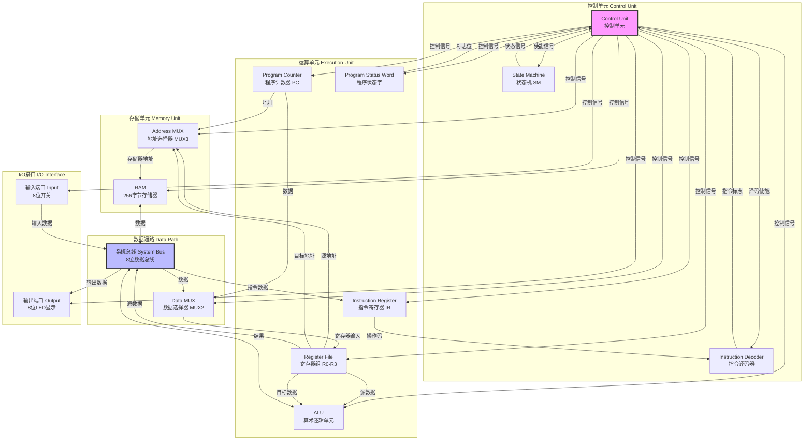
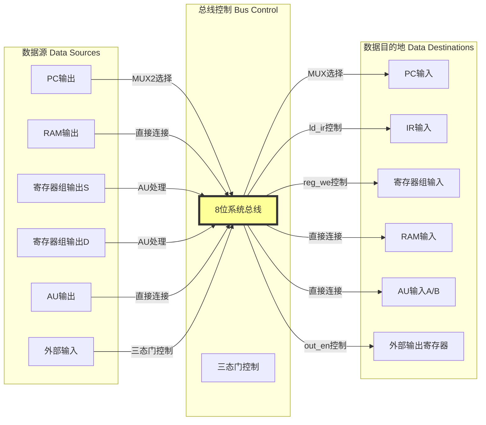
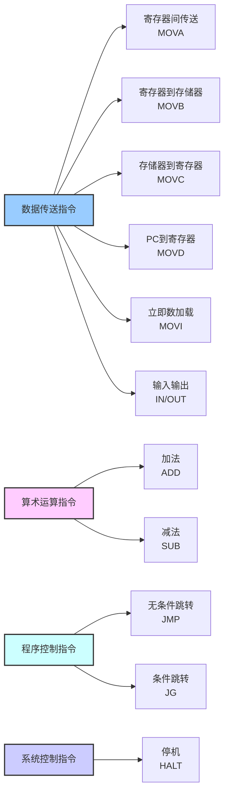
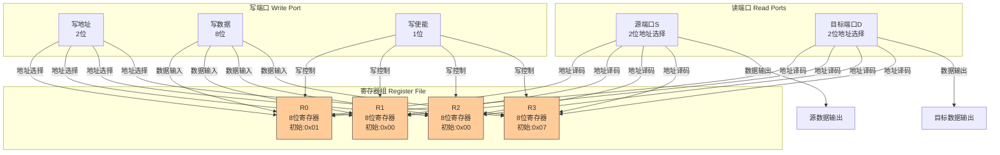
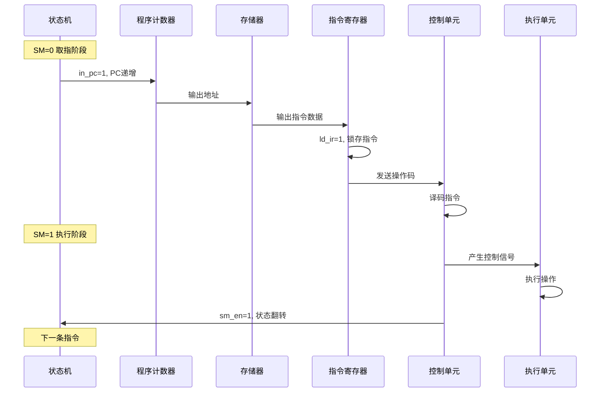
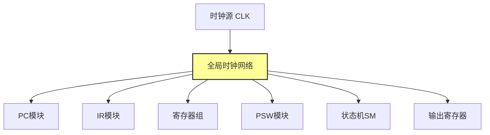

# 8位模型机设计文档

## 摘要

本文档详细阐述了一款基于冯·诺依曼架构的8位模型机的完整设计方案。该模型机采用Verilog HDL硬件描述语言实现，具备完整的指令系统、数据通路和控制单元设计。系统支持12条基本指令，包含数据传送、算术运算、程序控制和输入输出等功能模块，可作为计算机组成原理课程的教学实践平台。

---

## 1. 设计概述

### 1.1 设计目标与系统规格

本8位模型机的设计旨在为计算机组成原理课程提供一个结构清晰、功能完整且易于理解的硬件实践平台。设计团队在项目初期确立了四个核心设计目标：教学示范性、结构完整性、可扩展性和工程实践性。教学示范性要求系统能够清晰展示计算机体系结构的核心概念，包括指令系统的设计原理、数据通路的构建方法以及控制单元的工作机制；结构完整性确保CPU的所有关键功能模块都能得到实现，并构成一个可执行的完整指令系统；可扩展性通过模块化的设计方法，使得后续的功能增强和性能优化能够以最小的改动成本实现；工程实践性要求整个设计能够基于FPGA平台进行实际的硬件验证和调试。

**表1-1 系统规格参数**

| 参数项目 | 规格说明 | 设计考量 |
|---------|---------|---------|
| 数据位宽 | 8位 | 符合经典教学传统，FPGA资源约束下可实现较高时钟频率 |
| 地址空间 | 256字节（8位地址） | 足以支撑教学演示程序运行 |
| 通用寄存器 | 4个（R0-R3） | 提供足够的操作数存储空间 |
| 指令条数 | 12条 | 涵盖数据传送、算术运算、程序控制和I/O等基本操作 |
| 时钟方式 | 同步时序，下降沿触发 | 简化时序分析，与FPGA内嵌存储器接口兼容 |
| 存储器组织 | 哈佛架构变体，程序与数据共享RAM | 简化地址选择逻辑，体现冯·诺依曼架构特征 |

### 1.2 设计原则

整个系统设计遵循一系列严谨的设计原则。**简洁性原则**要求设计方案尽可能采用最简化的实现方式，突出核心概念而非复杂的优化技巧，这使得学生能够专注于理解计算机的基本工作原理。**模块化原则**体现在每个功能单元的独立设计上，通过明确定义的接口降低模块间的耦合度，这不仅便于教学演示时的分模块讲解，也为后续的功能扩展提供了便利。**同步设计原则**强制使用统一的时钟信号，所有寄存器操作都在时钟边沿完成，这种设计有效避免了异步时序电路中常见的竞争冒险问题，提高了系统的可靠性。**可观测性原则**要求在顶层模块预留充分的测试信号接口，包括总线数据、程序计数器值、指令寄存器内容和状态机状态等关键信号，这些测试点为硬件调试和教学演示提供了必要的观测手段。

---

## 2. 整体架构设计

### 2.1 系统总体架构

本模型机采用经典的单总线架构设计，所有功能模块通过一条8位宽的内部总线进行数据交换，这种设计在硬件资源消耗和控制复杂度之间取得了良好的平衡。系统主要由四个核心子系统构成：控制单元负责指令译码和时序控制，运算单元执行算术和逻辑操作，存储单元提供程序和数据的存储空间，而I/O接口则实现与外部环境的交互。



**图2-1 系统总体架构图**

### 2.2 数据通路设计

数据通路是计算机中数据流动的物理路径，本设计采用单总线结构具有显著的教学优势。单总线架构的核心特征是所有数据源和数据目的地都连接到同一条共享总线上，通过精确的时序控制和三态门管理来避免数据冲突。



**图2-2 数据通路详细连接图**

### 2.3 控制单元设计

控制单元是整个系统的神经中枢，负责根据当前指令和系统状态产生所有必要的控制信号。本设计采用硬布线控制方式，即控制信号完全由组合逻辑电路产生，不使用微程序控制。

```mermaid
graph TD
    A[输入信号] --> B[控制单元核心]
    B --> C[输出控制信号]

    A --> A1[状态机SM<br/>sm: 0/1]
    A --> A2[指令操作码<br/>ir_opcode[3:0]]
    A --> A3[状态标志<br/>psw_g]

    C --> C1[PC控制信号<br/>ld_pc, in_pc]
    C --> C2[IR控制信号<br/>ld_ir]
    C --> C3[寄存器控制<br/>reg_we]
    C --> C4[存储器控制<br/>ram_we, ram_re]
    C --> C5[AU控制信号<br/>au_en]
    C --> C6[PSW控制信号<br/>g_en]
    C --> C7[I/O控制信号<br/>in_en, out_en]
    C --> C8[MUX选择信号<br/>s_sel, s0_sel]

    style B fill:#f96,stroke:#333,stroke-width:2px
```

**图2-3 控制单元输入输出关系**

---

## 3. 指令系统设计

### 3.1 指令格式与编码表

本系统采用固定长度的指令格式，每条指令占用一个字节。指令字节被划分为两个4位字段：高4位为操作码字段，低4位为操作数/地址码字段。

```
┌─────────────┬───────────────────────┐
│  操作码OP   │    操作数/地址码       │
│  [7:4]      │    [3:0]              │
│  4位        │    4位                │
└─────────────┴───────────────────────┘
```

**表3-1 完整指令系统编码表**

| 指令 | 操作码 | 汇编格式 | 功能说明 | 影响标志 |
|-----|--------|---------|---------|---------|
| MOVA | 0100 | MOVA Rd, Rs | Rd ← Rs | 否 |
| MOVB | 0101 | MOVB addr, Rs | (addr) ← Rs | 否 |
| MOVC | 0110 | MOVC Rd, (Rs) | Rd ← (Rs) | 否 |
| MOVD | 0111 | MOVD Rd, PC | Rd ← PC | 否 |
| ADD | 1000 | ADD Rd, Rs | Rd ← Rd + Rs | 否 |
| SUB | 1001 | SUB Rd, Rs | Rd ← Rd - Rs; G←(Rs>Rd) | G |
| JMP | 1010 | JMP Rs | PC ← Rs | 否 |
| JG | 1011 | JG Rs | if(G) PC ← Rs | 否 |
| IN | 1100 | IN Rd | Rd ← Input | 否 |
| OUT | 1101 | OUT Rs | Output ← Rs | 否 |
| MOVI | 1110 | MOVI Rd | Rd ← (PC); PC++ | 否 |
| HALT | 1111 | HALT | 停机 | 否 |

### 3.2 指令分类与功能说明

根据功能特点，12条指令可分为四个主要类别：



**图3-1 指令分类结构图**

---

## 4. 功能模块详细设计

### 4.1 程序计数器（PC）

程序计数器用于存储下一条待执行指令的地址，支持装载和递增两种操作模式。

**Verilog实现：**
```verilog
module pc (
    input wire clk,          // 时钟信号
    input wire ld_pc,        // 装载控制信号
    input wire in_pc,        // 递增控制信号
    input wire [7:0] a,      // 8位数据输入
    output reg [7:0] c       // 8位计数器输出
);

    initial begin
        c = 8'b00000000;     // 初始值为0
    end

    always @(negedge clk) begin
        if (ld_pc == 1'b1 && in_pc == 1'b0) begin
            c <= a;          // 装载模式：c = a
        end
        else if (in_pc == 1'b1 && ld_pc == 1'b0) begin
            c <= c + 1'b1;   // 递增模式：c = c + 1
        end
        // 其他情况保持原值
    end

endmodule
```

**表4-1 PC操作模式真值表**

| ld_pc | in_pc | 操作 | 应用场景 |
|-------|-------|------|---------|
| 1 | 0 | c ← a | 跳转指令（JMP/JG） |
| 0 | 1 | c ← c + 1 | 顺序执行/MOVI指令 |
| 0 | 0 | c ← c | 其他情况 |
| 1 | 1 | 未定义 | 避免此组合 |

### 4.2 指令寄存器（IR）

指令寄存器用于在指令执行期间保存当前指令的内容。

**Verilog实现：**
```verilog
module ir (
    input wire clk,          // 时钟信号
    input wire ld_ir,        // 装载使能信号
    input wire [7:0] a,      // 8位数据输入（来自总线）
    output reg [7:0] x       // 8位指令输出（到译码器）
);

    initial begin
        x = 8'b00000000;     // 初始值为0
    end

    always @(negedge clk) begin
        if (ld_ir == 1'b1) begin
            x <= a;          // 仅在ld_ir=1时装载
        end
    end

endmodule
```

**IR位段划分：**
```
IR寄存器位段划分：
┌─────────┬─────────┬─────────┐
│ [7:4]   │ [3:2]   │ [1:0]   │
│ 操作码  │ DR字段  │ SR字段  │
└─────────┴─────────┴─────────┘
```

### 4.3 寄存器组（Register File）

寄存器组包含4个8位通用寄存器R0-R3，采用双端口读出、单端口写入的结构。

**Verilog实现：**
```verilog
module reg_group (
    input wire clk,          // 时钟
    input wire we,           // 写使能
    input wire [1:0] sr,     // 源寄存器选择
    input wire [1:0] dr,     // 目标寄存器选择
    input wire [7:0] i,      // 输入数据
    output reg [7:0] s,      // 源端口输出
    output reg [7:0] d       // 目标端口输出
);

    reg [7:0] r0, r1, r2, r3;

    // 初始化
    initial begin
        r0 = 8'h01;
        r1 = 8'h00;
        r2 = 8'h00;
        r3 = 8'h07;
    end

    // 写操作：下降沿触发
    always @(negedge clk) begin
        if (we == 1'b1) begin
            case (dr)
                2'b00: r0 <= i;
                2'b01: r1 <= i;
                2'b10: r2 <= i;
                2'b11: r3 <= i;
            endcase
        end
    end

    // 读操作：组合逻辑
    always @(*) begin
        case (sr)
            2'b00: s = r0;
            2'b01: s = r1;
            2'b10: s = r2;
            2'b11: s = r3;
            default: s = 8'h00;
        endcase
    end

    always @(*) begin
        case (dr)
            2'b00: d = r0;
            2'b01: d = r1;
            2'b10: d = r2;
            2'b11: d = r3;
            default: d = 8'h00;
        endcase
    end

endmodule
```

**寄存器组结构图：**


**图4-1 寄存器组结构图**

### 4.4 算术逻辑单元（AU）

算术逻辑单元执行算术运算和数据传送操作。

**Verilog实现：**
```verilog
module au (
    input        au_en,    // 使能信号
    input  [3:0] ac,       // 操作码
    input  [7:0] a,        // 输入A
    input  [7:0] b,        // 输入B
    output reg [7:0] t,    // 输出结果
    output reg       gf    // 状态标志
);

    always @(*) begin
        // 默认初始化
        t  = 8'hZZ; // 默认为高阻态
        gf = 1'b0;  // 默认gf为0

        if (au_en == 1'b1) begin
            case (ac)
                // 加法操作：t = a + b, gf = 0
                4'b1000: begin
                    t  = a + b;
                    gf = 1'b0;
                end

                // 减法操作：t = b - a, 若 b > a (有符号) 则 gf=1
                4'b1001: begin
                    t = b - a;
                    if ($signed(b) > $signed(a))
                        gf = 1'b1;
                    else
                        gf = 1'b0;
                end

                // 数据传送 (MOVE/OUT): t = a, gf = 0
                // 对应指令: MOVA(0100), MOVB(0101), OUT(1101)
                4'b0100, 4'b0101, 4'b1101: begin
                    t  = a;
                    gf = 1'b0;
                end

                // 默认情况：高阻态
                default: begin
                    t  = 8'hZZ;
                    gf = 1'b0;
                end
            endcase
        end
        else begin
            // au_en = 0，高阻态
            t  = 8'hZZ;
            gf = 1'b0;
        end
    end

endmodule
```

**AU操作分类：**
```mermaid
graph TD
    A[AU操作码] --> B[1000 ADD<br/>加法]
    A --> C[1001 SUB<br/>减法]
    A --> D[0100/0101/1101<br/>数据传送]

    B --> E[t = a + b<br/>gf = 0]
    C --> F[t = b - a<br/>gf = (b > a)]
    D --> G[t = a<br/>gf = 0]

    style A fill:#f9f,stroke:#333,stroke-width:2px
```

**图4-2 AU操作分类**

### 4.5 控制单元（Control Unit）

控制单元是系统的指挥中心，负责产生所有控制信号。

**Verilog实现：**
```verilog
module control_unit (
    input  wire       sm,          // 状态机状态 (0:取指, 1:执行)
    input  wire [3:0] ir_opcode,   // 指令操作码 (IR高4位)
    input  wire       psw_g,       // 标志位 G

    // 控制信号输出
    output wire       sm_en,       // 状态机转换使能
    output wire       ld_pc,       // PC装载 (跳转)
    output wire       in_pc,       // PC递增
    output wire       ld_ir,       // IR装载
    output wire [1:0] s_sel,       // MUX3选择 (RAM地址源)
    output wire       ram_we,      // RAM写使能
    output wire       ram_re,      // RAM读使能
    output wire       reg_we,      // 寄存器写使能
    output wire       s0_sel,      // MUX2选择 (寄存器输入源)
    output wire       au_en,       // AU使能
    output wire       g_en,        // PSW写使能
    output wire       in_en,       // 输入设备使能
    output wire       out_en       // 输出设备使能
);

    // 内部信号：指令译码输出
    wire is_mova, is_movb, is_movc, is_movd;
    wire is_add, is_sub;
    wire is_jmp, is_jg;
    wire is_in, is_out, is_movi, is_halt;

    // 指令译码器实例化
    ins_decode u_decode (
        .en   (1'b1),
        .ir   (ir_opcode),
        .mova (is_mova), .movb (is_movb), .movc (is_movc), .movd (is_movd),
        .add  (is_add),  .sub  (is_sub),
        .jmp  (is_jmp),  .jg   (is_jg),
        .in1  (is_in),   .out1 (is_out), .movi (is_movi), .halt (is_halt)
    );

    // 控制信号产生逻辑
    assign sm_en = !is_halt;

    assign ld_pc = sm & (is_jmp | (is_jg & psw_g));
    assign in_pc = (~sm) | (sm & is_movi);

    assign s_sel[1] = sm & is_movb;
    assign s_sel[0] = sm & is_movc;

    assign ram_we = sm & is_movb;
    assign ram_re = (~sm) | (sm & (is_movc | is_movi));

    assign ld_ir = ~sm;

    assign reg_we = sm & (is_mova | is_movc | is_movd | is_movi | is_add | is_sub | is_in);

    assign s0_sel = ~(sm & is_movd);

    assign au_en = sm & (is_mova | is_movb | is_out | is_add | is_sub);

    assign g_en = sm & is_sub;

    assign in_en  = sm & is_in;
    assign out_en = sm & is_out;

endmodule
```

---

## 5. 指令执行流程

### 5.1 指令周期时序

本模型机采用两级指令周期设计，每个指令周期包含取指阶段和执行阶段。



**图5-1 指令执行时序图**

### 5.2 典型指令执行流程示例

**表5-1 MOVA指令执行流程**

| 时钟周期 | SM状态 | 操作说明 | 关键控制信号 |
|---------|--------|---------|-------------|
| T0 | 0 | 取指：RAM[PC] → IR, PC++ | ld_ir=1, in_pc=1, ram_re=1 |
| T1 | 1 | 执行：Rs → AU → 总线 → RegFile → Rd | reg_we=1, s0_sel=1, au_en=1 |
| T2 | 0 | 下一条指令取指 | 同T0 |

**数据通路：**
```
Rs → RegFile.S端口 → AU输入A → AU输出 → 总线 → MUX2 → RegFile写入 → Rd
```

**表5-2 SUB指令执行流程**

| 时钟周期 | SM状态 | 操作说明 | 关键控制信号 |
|---------|--------|---------|-------------|
| T0 | 0 | 取指：RAM[PC] → IR, PC++ | ld_ir=1, in_pc=1, ram_re=1 |
| T1 | 1 | 执行：Rd - Rs → AU → 总线 → RegFile → Rd, 更新G标志 | reg_we=1, au_en=1, g_en=1 |
| T2 | 0 | 下一条指令取指 | 同T0 |

**标志位生成逻辑：**
```verilog
if ($signed(Rs) > $signed(Rd))
    PSW.G = 1;  // 被减数大于减数
else
    PSW.G = 0;
```

---

## 6. 控制信号详解

### 6.1 控制信号分类表

**表6-1 控制信号功能分类**

| 信号类别 | 信号名称 | 类型 | 功能描述 | 有效电平 |
|---------|---------|------|---------|---------|
| PC控制 | ld_pc | 输出 | PC装载控制 | 高电平 |
|         | in_pc | 输出 | PC递增控制 | 高电平 |
| IR控制 | ld_ir | 输出 | IR装载控制 | 高电平 |
| 寄存器控制 | reg_we | 输出 | 寄存器写使能 | 高电平 |
|           | s_sel[1:0] | 输出 | 源寄存器选择 | 编码 |
|           | s0_sel | 输出 | MUX2选择信号 | 0:PC, 1:BUS |
| 存储器控制 | ram_we | 输出 | RAM写使能 | 高电平 |
|           | ram_re | 输出 | RAM读使能 | 高电平 |
| AU控制 | au_en | 输出 | AU使能信号 | 高电平 |
| PSW控制 | g_en | 输出 | G标志写使能 | 高电平 |
| I/O控制 | in_en | 输出 | 输入设备使能 | 高电平 |
|         | out_en | 输出 | 输出锁存使能 | 高电平 |

### 6.2 控制信号产生逻辑

**表6-2 控制信号真值表（部分）**

| 指令 | SM | ld_pc | in_pc | ld_ir | reg_we | ram_we | ram_re | au_en | g_en | in_en | out_en |
|-----|----|-------|-------|-------|--------|--------|--------|-------|------|-------|--------|
| MOVA | 0 | 0 | 1 | 1 | 0 | 0 | 1 | 0 | 0 | 0 | 0 |
| MOVA | 1 | 0 | 0 | 0 | 1 | 0 | 0 | 1 | 0 | 0 | 0 |
| MOVB | 0 | 0 | 1 | 1 | 0 | 0 | 1 | 0 | 0 | 0 | 0 |
| MOVB | 1 | 0 | 0 | 0 | 0 | 1 | 0 | 1 | 0 | 0 | 0 |
| SUB | 0 | 0 | 1 | 1 | 0 | 0 | 1 | 0 | 0 | 0 | 0 |
| SUB | 1 | 0 | 0 | 0 | 1 | 0 | 0 | 1 | 1 | 0 | 0 |
| JMP | 0 | 0 | 1 | 1 | 0 | 0 | 1 | 0 | 0 | 0 | 0 |
| JMP | 1 | 1 | 0 | 0 | 0 | 0 | 0 | 0 | 0 | 0 | 0 |
| IN | 0 | 0 | 1 | 1 | 0 | 0 | 1 | 0 | 0 | 0 | 0 |
| IN | 1 | 0 | 0 | 0 | 1 | 0 | 0 | 0 | 0 | 1 | 0 |
| OUT | 0 | 0 | 1 | 1 | 0 | 0 | 1 | 0 | 0 | 0 | 0 |
| OUT | 1 | 0 | 0 | 0 | 0 | 0 | 0 | 1 | 0 | 0 | 1 |
| HALT | 0 | 0 | 1 | 1 | 0 | 0 | 1 | 0 | 0 | 0 | 0 |
| HALT | 1 | 0 | 0 | 0 | 0 | 0 | 0 | 0 | 0 | 0 | 0 |

---

## 7. 时序设计

### 7.1 时钟策略

系统采用统一的时钟源，所有时序逻辑元件都在时钟下降沿触发。

**时钟周期示意：**
```
    ┌───┐   ┌───┐   ┌───┐   ┌───┐
CLK │   │   │   │   │   │   │   │
    └───┘   └───┘   └───┘   └───┘
      ↓       ↓       ↓       ↓
    取指    执行    取指    执行
    SM=0    SM=1    SM=0    SM=1
```

**全局时钟分配：**


**图7-1 全局时钟分配**

### 7.2 关键时序路径

**取指阶段时序：**
```
时刻T0：时钟下降沿
├─ PC递增 (in_pc=1)
└─ 新PC值稳定

时刻T0+Δt：RAM访问
├─ 地址信号有效
├─ RAM输出数据
└─ 总线数据稳定

时刻T1：下一个时钟下降沿
├─ IR锁存总线数据 (ld_ir=1)
└─ 新指令有效
```

**执行阶段时序：**
```
时刻T1：时钟下降沿
├─ IR指令有效
├─ 指令译码完成
├─ 控制信号生成
└─ SM状态翻转为1

时刻T1+Δt：执行操作
├─ 寄存器读取（组合逻辑）
├─ AU运算（组合逻辑）
├─ RAM读写（同步逻辑）
└─ 数据稳定在总线

时刻T2：下一个时钟下降沿
├─ 寄存器组写入 (reg_we=1)
├─ PSW更新 (g_en=1)
├─ PC操作 (ld_pc/in_pc)
└─ SM状态翻转为0
```

### 7.3 时序约束建议

```tcl
# 时钟周期约束（假设50MHz）
create_clock -name clk -period 20 [get_ports clk]

# 输入延迟约束
set_input_delay -clock clk 5 [get_ports input_data*]

# 输出延迟约束
set_output_delay -clock clk 5 [get_ports output_data*]

# 多周期路径约束（可选）
set_multicycle_path 2 -setup [get_cells ...]
```

---

## 8. 测试与验证

### 8.1 测试程序（ram_init.mif）

**表8-1 测试程序指令序列**

| 地址 | 机器码 | 指令 | 功能说明 |
|-----|--------|------|---------|
| 00 | A3 | JMP (R3) | 跳转到地址07（R3=07） |
| 01 | 11 | 数据 | 初始数据0x11 |
| 07 | C4 | IN R1 | R1 ← 输入(01H) |
| 08 | 49 | MOVA R2, R1 | R2 ← R1 (R2=01) |
| 09 | 64 | MOVC R1, M | R1 ← RAM[R0] (R1=11) |
| 0A | 96 | SUB R1, R2 | R1 ← R1 - R2, G=1 |
| 0B | 7C | MOVD R3, PC | R3 ← PC (R3=0C) |
| 0C | 8D | ADD R3, R1 | R3 ← R3 + R1 (R3=1C) |
| 0D | B3 | JG (R3) | G=1, 跳转到1C |
| 1C | 53 | MOVB M, R3 | RAM[01] ← R3 (1C) |
| 1D | 64 | MOVC R1, M | R1 ← RAM[01] (R1=1C) |
| 1E | E0 | MOVI #09 | R0 ← 09 |
| 1F | 09 | 立即数 | |
| 20 | 91 | SUB R0, R1 | R0 ← R0 - R1, G=0 |
| 21 | B3 | JG (R3) | G=0, 不跳转 |
| 22 | D0 | OUT R0 | 输出 R0=EDH |
| 23 | F0 | HALT | 停机 |

### 8.2 Testbench框架

**Verilog测试平台：**
```verilog
`timescale 1ns/1ns

module tb_Top_Computer;

    // 信号定义
    reg clk;
    reg rst_n;
    reg [7:0] input_data;
    wire [7:0] output_data;

    // 测试信号
    wire [7:0] test_bus;
    wire [7:0] test_pc;
    wire [7:0] test_ir;
    wire test_sm;

    // 被测模块实例化
    Top_Computer uut (
        .clk(clk),
        .rst_n(rst_n),
        .input_data(input_data),
        .output_data(output_data),
        .test_bus(test_bus),
        .test_pc(test_pc),
        .test_ir(test_ir),
        .test_sm(test_sm)
    );

    // 时钟生成（50MHz，周期20ns）
    initial begin
        clk = 0;
        forever #10 clk = ~clk;
    end

    // 测试激励
    initial begin
        // 初始化
        rst_n = 0;
        input_data = 8'h01;  // 设置输入数据为0x01
        #20;
        rst_n = 1;  // 释放复位

        // 显示表头
        $display("=== Simulation Start: 5 + 3 Calculation ===");
        $display("Time\tPC\tIR\tState\tR0\tR1\tBUS\tOUT");

        // 运行足够时间完成测试程序
        #1000;

        $display("=== Simulation Finished ===");
        $stop;
    end

    // 监控输出
    always @(posedge clk) begin
        $strobe("T=%0t\tPC=%h\tIR=%h\tSM=%b\tR0=%h\tR1=%h\tBUS=%h\tOut=%h",
                $time,
                uut.u_pc.c,       // PC当前值
                uut.u_ir.x,       // IR当前指令
                uut.u_sm.sm,      // 当前状态 (0:取指, 1:执行)
                uut.u_regs.r0,    // R0内部值
                uut.u_regs.r1,    // R1内部值
                uut.bus,          // 总线值
                output_data       // 输出端口值
        );
    end

endmodule
```

### 8.3 硬件验证方法

**FPGA验证步骤：**
1. **连接LED**：将测试信号连接到LED显示
2. **使用逻辑分析仪**：捕获测试信号的时序波形
3. **单步执行**：降低时钟频率，观察每步执行结果

**观察要点：**
- **test_bus**：每个执行阶段应有正确的数据
- **test_pc**：应按预期递增或跳转
- **test_ir**：每条指令应正确读取
- **test_sm**：应在0和1之间规律翻转

---

## 9. 设计总结

### 9.1 设计特点

本8位模型机设计体现了教学导向的工程设计理念，具有以下特点：

1. **架构简洁**：采用单总线结构，各模块清晰
2. **功能完整**：具备完整的指令系统和数据通路
3. **易于理解**：控制逻辑采用硬布线实现，便于学习
4. **可扩展性强**：模块化设计，便于功能扩展
5. **工程实用**：基于FPGA实现，可实际硬件验证

### 9.2 关键技术点

| 技术点 | 实现方式 | 教学价值 |
|-------|---------|---------|
| 同步时序设计 | 统一时钟，下降沿触发 | 避免时序问题，简化分析 |
| 硬布线控制 | 组合逻辑产生控制信号 | 逻辑关系直观，便于理解 |
| 总线复用 | 单总线架构，三态门控制 | 体现资源共享概念 |
| 状态机控制 | 取指/执行两阶段 | 清晰的指令周期概念 |
| 标志位机制 | G标志支持条件跳转 | 条件执行的基本原理 |

### 9.3 扩展建议

**指令系统扩展（保留操作码0000-0011）：**
- 逻辑运算：AND, OR, XOR, NOT
- 移位操作：SHR, SHL
- 堆栈操作：PUSH, POP
- 子程序调用：CALL, RET

**性能优化方向：**
- 引入5级流水线（IF-ID-EX-MEM-WB）
- 增加指令Cache和数据Cache
- 扩展为多总线架构
- 添加中断系统

---

## 附录A：术语表

| 术语 | 英文全称 | 中文说明 |
|------|---------|---------|
| PC | Program Counter | 程序计数器，存储下一条指令地址 |
| IR | Instruction Register | 指令寄存器，存储当前指令 |
| AU | Arithmetic Unit | 算术逻辑单元，执行运算操作 |
| PSW | Program Status Word | 程序状态字，存储标志位 |
| SM | State Machine | 状态机，控制CPU工作状态 |
| RAM | Random Access Memory | 随机存取存储器 |
| MUX | Multiplexer | 多路选择器 |
| FPGA | Field Programmable Gate Array | 现场可编程门阵列 |
| HDL | Hardware Description Language | 硬件描述语言 |
| RTL | Register Transfer Level | 寄存器传输级 |

---

## 附录B：完整Verilog代码清单

### B.1 顶层模块（Top_Computer.v）

```verilog
module Top_Computer (
    input  wire       clk,          // 系统时钟
    input  wire       rst_n,        // 复位信号
    input  wire [7:0] input_data,   // 外部输入（开关）
    output wire [7:0] output_data,  // 外部输出（LED/显示器）

    // 调试接口
    output wire [7:0] test_bus,     // 观察总线实时数据
    output wire [7:0] test_pc,      // 观察当前PC值
    output wire [7:0] test_ir,      // 观察当前指令
    output wire       test_sm       // 观察状态机状态
);

    // 内部连线定义
    wire [7:0] bus;
    wire [7:0] pc_out;
    wire [7:0] mux3_out;
    wire [7:0] ir_out;
    wire [7:0] reg_s_out;
    wire [7:0] reg_d_out;
    wire [7:0] mux2_out;
    wire       au_gf;
    wire       psw_g;

    wire       sm;
    wire       sm_en;
    wire       ld_pc, in_pc;
    wire       ld_ir;
    wire [1:0] s_sel;
    wire       ram_we, ram_re;
    wire       reg_we;
    wire       s0_sel;
    wire       au_en;
    wire       g_en;
    wire       in_en, out_en;

    // 寄存器地址特殊处理
    wire [1:0] reg_sr_addr = (ir_out[7:4] == 4'b1010 || ir_out[7:4] == 4'b1011) ? 2'b11 :
                             (ir_out[7:4] == 4'b0110) ? 2'b00 : ir_out[1:0];
    wire [1:0] reg_dr_addr = (ir_out[7:4] == 4'b0101) ? 2'b00 : ir_out[3:2];

    // 模块实例化
    control_unit u_cu (
        .sm(sm), .ir_opcode(ir_out[7:4]), .psw_g(psw_g),
        .sm_en(sm_en),
        .ld_pc(ld_pc), .in_pc(in_pc),
        .ld_ir(ld_ir),
        .s_sel(s_sel),
        .ram_we(ram_we), .ram_re(ram_re),
        .reg_we(reg_we),
        .s0_sel(s0_sel),
        .au_en(au_en),
        .g_en(g_en),
        .in_en(in_en), .out_en(out_en)
    );

    sm u_sm (
        .clk(clk), .sm_en(sm_en), .sm(sm)
    );

    pc u_pc (
        .clk(clk), .ld_pc(ld_pc), .in_pc(in_pc),
        .a(reg_s_out),
        .c(pc_out)
    );

    mux_3_1 u_mux3 (
        .a(pc_out), .b(reg_s_out), .c(reg_d_out),
        .s(s_sel), .y(mux3_out)
    );

    lpm_ram_io #(
        .LPM_WIDTH(8),
        .LPM_WIDTHAD(8),
        .LPM_NUMWORDS(256),
        .LPM_FILE("ram_init.mif"),
        .LPM_INDATA("REGISTERED"),
        .LPM_ADDRESS_CONTROL("REGISTERED"),
        .LPM_OUTDATA("UNREGISTERED")
    ) u_ram (
        .inclock (clk),
        .we      (ram_we),
        .outenab (ram_re),
        .address (mux3_out),
        .dio     (bus)
    );

    ir u_ir (
        .clk(clk), .ld_ir(ld_ir), .a(bus),
        .x(ir_out)
    );

    mux_2_1 u_mux2 (
        .a(pc_out), .b(bus), .s(s0_sel),
        .y(mux2_out)
    );

    reg_group u_regs (
        .clk(clk), .we(reg_we),
        .sr(reg_sr_addr), .dr(reg_dr_addr),
        .i(mux2_out),
        .s(reg_s_out), .d(reg_d_out)
    );

    au u_au (
        .au_en(au_en), .ac(ir_out[7:4]),
        .a(reg_s_out), .b(reg_d_out),
        .t(bus),
        .gf(au_gf)
    );

    psw u_psw (
        .clk(clk), .g_en(g_en), .g(au_gf),
        .gf(psw_g)
    );

    // I/O接口
    assign bus = (in_en) ? input_data : 8'bzzzzzzzz;

    reg [7:0] out_reg;
    always @(posedge clk or negedge rst_n) begin
        if (!rst_n) begin
            out_reg <= 8'h00;
        end
        else if (out_en) begin
            out_reg <= bus;
        end
    end
    assign output_data = out_reg;

    // 调试信号
    assign test_bus = bus;
    assign test_pc  = pc_out;
    assign test_ir  = ir_out;
    assign test_sm  = sm;

endmodule
```

### B.2 其他模块代码

（由于篇幅限制，其他模块代码请参考原始文件：au.v, control_unit.v, ins_decode.v, ir.v, mux_2_1.v, mux_3_1.v, pc.v, psw.v, reg_group.v, sm.v）

---

**文档信息**

- **文档版本**：V3.0（完整学术版）
- **编写日期**：2026年1月
- **适用对象**：计算机组成原理课程设计
- **文档类型**：系统设计说明书
- **编写语言**：中文
- **项目名称**：8位模型机设计

---

**版权声明**

本文档仅用于教学目的，不得用于商业用途。部分设计参考了相关教材和课程资料，版权归原作者所有。
