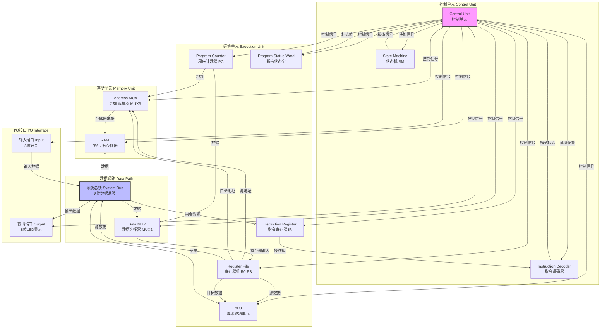
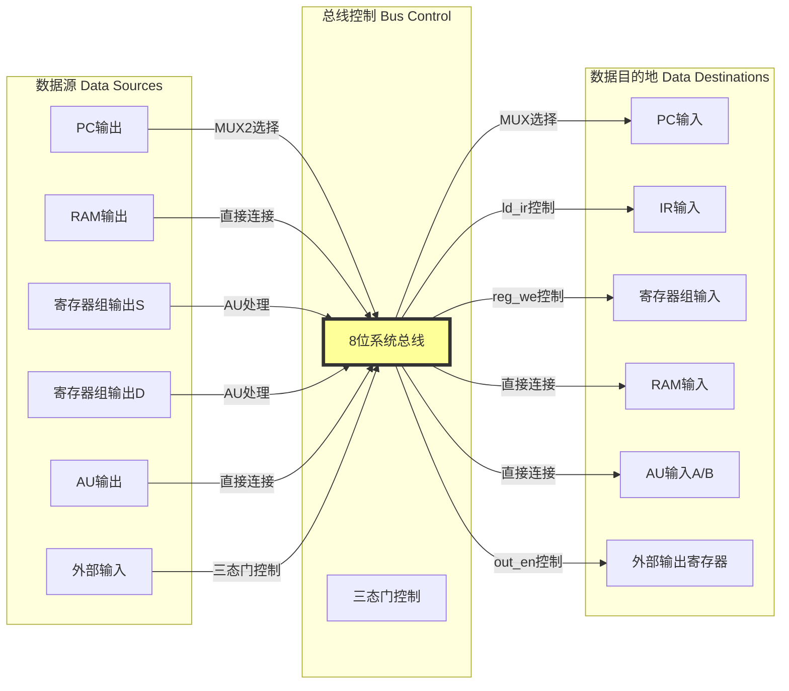
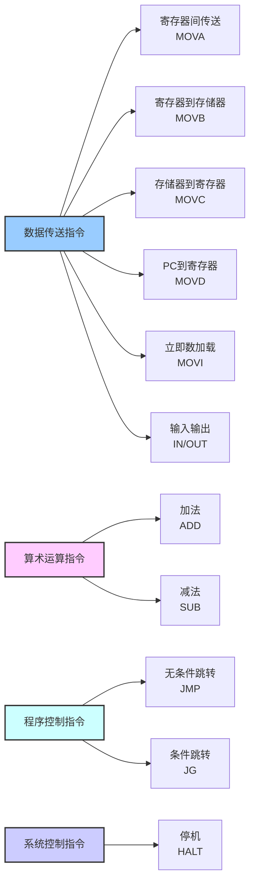
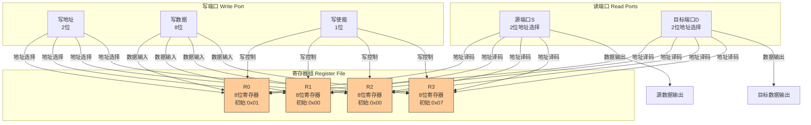
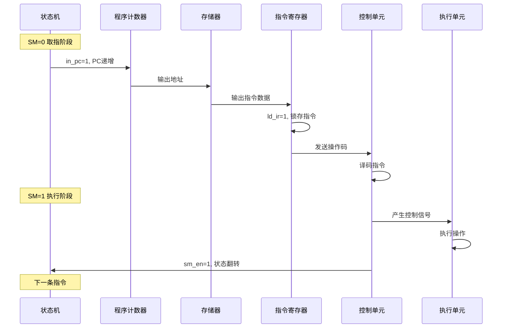
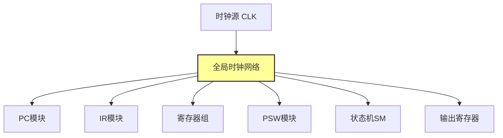

# 8位模型机设计文档

## 摘要

本文档详细阐述了一款基于冯·诺依曼架构的8位模型机的完整设计方案。该模型机采用Verilog HDL硬件描述语言实现，具备完整的指令系统、数据通路和控制单元设计。系统支持12条基本指令，包含数据传送、算术运算、程序控制和输入输出等功能模块，可作为计算机组成原理课程的教学实践平台。

---

## 1. 设计概述

### 1.1 设计目标与系统规格

本8位模型机的设计旨在为计算机组成原理课程提供一个结构清晰、功能完整且易于理解的硬件实践平台。设计团队在项目初期确立了四个核心设计目标：**教学示范性**、**结构完整性**、**可扩展性**和**工程实践性**。教学示范性要求系统能够清晰展示计算机体系结构的核心概念，包括指令系统的设计原理、数据通路的构建方法以及控制单元的工作机制。结构完整性确保CPU的所有关键功能模块都能得到实现，并构成一个可执行的完整指令系统。可扩展性通过模块化的设计方法，使得后续的功能增强和性能优化能够以最小的改动成本实现。工程实践性要求整个设计能够基于FPGA平台进行实际的硬件验证和调试。

在系统规格参数的确定过程中，设计团队充分考虑了教学需求与实现复杂度的平衡。**表1-1**详细列出了系统的各项规格参数及其设计考量。系统采用8位数据位宽，这既符合经典计算机体系结构的教学传统，又能在现代FPGA资源约束下实现较高的时钟频率。256字节的地址空间通过8位地址总线实现，虽然容量有限，但足以支撑教学演示程序的运行。寄存器文件包含4个8位通用寄存器（R0-R3），提供了足够的操作数存储空间。指令系统包含12条指令，涵盖了数据传送、算术运算、程序控制和输入输出等基本操作类型。时钟系统采用同步时序设计，所有时序逻辑元件均在时钟下降沿触发，这种设计选择不仅简化了时序分析，还与大多数FPGA内嵌存储器的接口时序保持一致。存储器组织采用哈佛架构的变体形式，程序指令和数据共享同一个RAM空间，这种设计在简化地址选择逻辑的同时，也体现了冯·诺依曼架构的核心特征。

**表1-1 系统规格参数**

| 参数项目 | 规格说明 | 设计考量 |
|---------|---------|---------|
| 数据位宽 | 8位 | 符合经典教学传统，FPGA资源约束下可实现较高时钟频率 |
| 地址空间 | 256字节（8位地址） | 足以支撑教学演示程序运行 |
| 通用寄存器 | 4个（R0-R3） | 提供足够的操作数存储空间 |
| 指令条数 | 12条 | 涵盖数据传送、算术运算、程序控制和I/O等基本操作 |
| 时钟方式 | 同步时序，下降沿触发 | 简化时序分析，与FPGA内嵌存储器接口兼容 |
| 存储器组织 | 哈佛架构变体，程序与数据共享RAM | 简化地址选择逻辑，体现冯·诺依曼架构特征 |

### 1.2 设计原则

整个系统设计遵循一系列严谨的设计原则。**简洁性原则**要求设计方案尽可能采用最简化的实现方式，突出核心概念而非复杂的优化技巧。这使得学生能够专注于理解计算机的基本工作原理，而不是被复杂的工程细节所困扰。**模块化原则**体现在每个功能单元的独立设计上，通过明确定义的接口降低模块间的耦合度。这不仅便于教学演示时的分模块讲解，也为后续的功能扩展提供了便利。**同步设计原则**强制使用统一的时钟信号，所有寄存器操作都在时钟边沿完成。这种设计有效避免了异步时序电路中常见的竞争冒险问题，提高了系统的可靠性。**可观测性原则**要求在顶层模块预留充分的测试信号接口，包括总线数据、程序计数器值、指令寄存器内容和状态机状态等关键信号。这些测试点为硬件调试和教学演示提供了必要的观测手段。

---

## 2. 整体架构设计

### 2.1 系统总体架构

本模型机采用经典的**单总线架构设计**，所有功能模块通过一条8位宽的内部总线进行数据交换，这种设计在硬件资源消耗和控制复杂度之间取得了良好的平衡。从功能划分的角度来看，系统主要由四个核心子系统构成：控制单元负责指令译码和时序控制，运算单元执行算术和逻辑操作，存储单元提供程序和数据的存储空间，而I/O接口则实现与外部环境的交互。

**控制单元**作为整个系统的指挥中心，由控制单元核心逻辑、状态机和指令译码器三个组件协同工作。状态机维护系统的执行状态，通过取指和执行两个状态的交替切换，实现指令的周期性执行流程。指令译码器接收指令寄存器的高4位操作码，将其转换为12个独立的指令识别信号。这些信号与状态信号共同驱动控制单元核心逻辑产生最终的控制信号。

**运算单元**包含程序计数器、指令寄存器、寄存器文件、算术逻辑单元和程序状态字五个关键组件。程序计数器存储下一条待执行指令的地址，支持装载和递增两种操作模式。指令寄存器在取指阶段锁存从存储器读出的指令，并将其分段为操作码和操作数字段供后续阶段使用。寄存器文件提供4个8位通用寄存器，采用双端口读出、单端口写入的结构，支持同时读取两个操作数。算术逻辑单元执行加法、减法和数据传送操作，并根据运算结果生成状态标志。程序状态字保存运算过程中的状态信息，当前仅实现大于标志用于条件跳转控制。

**存储单元**采用256字节的RAM模块，通过三选一多路选择器选择存储器地址源。地址选择器的三个输入分别来自程序计数器（用于取指阶段）、源寄存器（用于MOVC指令）和目标寄存器（用于MOVB指令）。这种设计使得存储器能够在不同指令阶段服务于不同的数据访问需求。

**I/O接口**采用三态门实现的输入通道和寄存器锁存的输出通道。输入接口仅在IN指令执行期间将外部数据驱动到总线上，其他时间保持高阻态以释放总线资源。输出接口通过一个专门的寄存器锁存OUT指令写入的数据，确保输出值在指令执行结束后仍能保持稳定。



**图2-1展示了系统总体架构的完整连接关系**。图中可以清晰地看到，控制单元位于整个系统的核心位置，它接收来自状态机、指令译码器和程序状态字的反馈信息，并向所有其他模块输出控制信号。数据总线作为系统的信息传输通道，连接了存储器、算术逻辑单元、寄存器组和I/O接口等关键模块。多路选择器MUX2和MUX3分别负责数据源和地址源的选择，是数据通路灵活性的关键保障。

### 2.2 数据通路设计

数据通路是计算机中数据流动的物理路径，本设计采用单总线结构具有显著的教学优势。单总线架构的核心特征是所有数据源和数据目的地都连接到同一条共享总线上，通过精确的时序控制和三态门管理来避免数据冲突。这种结构虽然在性能上不如多总线架构，但其简洁性使得数据流动路径清晰可见，便于学生理解计算机内部的数据传输机制。

在本设计中，数据通路的组成要素包括多个数据源和多个数据目的地。**数据源**主要包括程序计数器的输出、寄存器组的源端口输出、算术逻辑单元的运算结果以及外部输入设备。这些数据源通过各自的输出控制逻辑连接到总线上，只有在相应控制信号有效时才会驱动总线。**数据目的地**包括程序计数器的输入、指令寄存器的输入、寄存器组的写入端口、存储器的数据输入以及算术逻辑单元的两个操作数输入。

总线控制采用**三态门机制**来实现多源共享。当某个模块需要向总线发送数据时，相应的三态门被使能，其他模块的三态门则处于高阻态。这种机制要求控制信号的产生必须严格遵循时序约束，确保在任何时刻只有一个数据源驱动总线，避免总线冲突。

时序控制是数据通路正常工作的关键。系统采用同步设计，所有寄存器在时钟下降沿采样输入数据。在一个完整的指令周期内，数据通路需要经历两个不同的阶段：**取指阶段**和**执行阶段**。在取指阶段，程序计数器的值通过地址选择器送到存储器地址端口，存储器读出的指令数据通过总线加载到指令寄存器中，同时程序计数器递增。在执行阶段，根据指令类型，数据可能在寄存器文件、算术逻辑单元、存储器和I/O接口之间流动，最终的结果被写回到目标位置。



**图2-2数据通路详细连接图**展示了系统中所有数据源和数据目的地与总线的连接关系。图中可以清晰地看到，数据源和目的地通过不同的控制逻辑连接到总线上，这种设计确保了数据在正确的时间流向正确的位置。

### 2.3 控制单元设计

控制单元是整个系统的神经中枢，负责根据当前指令和系统状态产生所有必要的控制信号。本设计采用**硬布线控制方式**，即控制信号完全由组合逻辑电路产生，不使用微程序控制。这种选择基于教学目的考虑，硬布线控制的逻辑关系直观明确，便于学生理解控制信号的产生原理。

控制单元的输入信号包括状态机状态（sm）、指令操作码（ir_opcode[3:0]）和程序状态字的标志位（psw_g）。**状态信号**指示当前处于取指阶段还是执行阶段，这直接影响大多数控制信号的有效性。**操作码字段**来自指令寄存器的高4位，经过指令译码器转换为12个独立的指令识别信号。**标志位信号**提供条件跳转的判断依据，仅在执行条件跳转指令时被查询。

控制单元的输出信号涵盖了CPU所有功能模块的控制需求。**程序计数器控制**包括装载信号（ld_pc）和递增信号（in_pc），这两个信号的组合决定了PC的操作模式。**指令寄存器控制**仅有一个装载信号（ld_ir），在取指阶段有效。**寄存器文件控制**包括写使能信号（reg_we）和源寄存器选择信号（s_sel），其中s_sel还用于存储器地址选择。**存储器控制**包括写使能（ram_we）和读使能（ram_re）信号。**算术逻辑单元控制**仅有一个使能信号（au_en），用于控制AU是否输出有效数据。**程序状态字控制**包括标志位写使能（g_en），仅在减法指令时有效。**I/O控制**包括输入使能（in_en）和输出使能（out_en）信号。

控制信号的产生逻辑遵循严格的布尔表达式。例如，ld_pc信号在执行阶段且遇到跳转指令（JMP或条件跳转且条件满足）时有效；in_pc信号在取指阶段总是有效，或在执行阶段遇到MOVI指令时有效；reg_we信号在执行阶段且遇到需要写寄存器的指令时有效。这些逻辑关系体现了指令的精确语义，确保每个指令都能产生正确的操作序列。

```mermaid
graph TD
    A[输入信号] --> B[控制单元核心]
    B --> C[输出控制信号]

    A --> A1[状态机SM<br/>sm: 0/1]
    A --> A2[指令操作码<br/>ir_opcode[3:0]]
    A --> A3[状态标志<br/>psw_g]

    C --> C1[PC控制信号<br/>ld_pc, in_pc]
    C --> C2[IR控制信号<br/>ld_ir]
    C --> C3[寄存器控制<br/>reg_we]
    C --> C4[存储器控制<br/>ram_we, ram_re]
    C --> C5[AU控制信号<br/>au_en]
    C --> C6[PSW控制信号<br/>g_en]
    C --> C7[I/O控制信号<br/>in_en, out_en]
    C --> C8[MUX选择信号<br/>s_sel, s0_sel]

    style B fill:#f96,stroke:#333,stroke-width:2px
```

**图2-3控制单元输入输出关系**清晰地展示了控制单元如何接收来自系统各个部分的反馈信号，并产生控制所有模块工作的信号。这种输入输出模型体现了控制单元作为系统协调者的核心作用。

---

## 3. 指令系统设计

### 3.1 指令格式与编码表

本系统采用**固定长度的指令格式**，每条指令占用一个字节，这种设计简化了指令获取和译码过程。指令字节被划分为两个4位字段：高4位为操作码字段，低4位为操作数/地址码字段。

```
┌─────────────┬───────────────────────┐
│  操作码OP   │    操作数/地址码       │
│  [7:4]      │    [3:0]              │
│  4位        │    4位                │
└─────────────┴───────────────────────┘
```

操作码字段定义指令类型，支持最多16种指令，实际使用了12种。操作数字段的含义根据指令类型而变化，可能表示源寄存器编号、目标寄存器编号、寻址模式信息或立即数值。

**表3-1完整指令系统编码表**列出了所有12条指令的操作码、汇编格式、功能说明以及对标志位的影响。指令编码表的设计体现了系统功能的完整性和编码的规律性。数据传送指令使用0100到0111的操作码范围，涵盖了寄存器间传送、寄存器到存储器、存储器到寄存器以及PC到寄存器四种基本传送操作。算术运算指令使用1000和1001，分别对应加法和减法操作。程序控制指令使用1010和1011，实现无条件跳转和条件跳转。输入输出指令使用1100和1101，分别对应输入和输出操作。立即数加载指令使用1110，而停机指令使用1111。未使用的操作码0000到0011保留为未来扩展。

**表3-1 完整指令系统编码表**

| 指令 | 操作码 | 汇编格式 | 功能说明 | 影响标志 |
|-----|--------|---------|---------|---------|
| MOVA | 0100 | MOVA Rd, Rs | Rd ← Rs | 否 |
| MOVB | 0101 | MOVB addr, Rs | (addr) ← Rs | 否 |
| MOVC | 0110 | MOVC Rd, (Rs) | Rd ← (Rs) | 否 |
| MOVD | 0111 | MOVD Rd, PC | Rd ← PC | 否 |
| ADD | 1000 | ADD Rd, Rs | Rd ← Rd + Rs | 否 |
| SUB | 1001 | SUB Rd, Rs | Rd ← Rd - Rs; G←(Rs>Rd) | G |
| JMP | 1010 | JMP Rs | PC ← Rs | 否 |
| JG | 1011 | JG Rs | if(G) PC ← Rs | 否 |
| IN | 1100 | IN Rd | Rd ← Input | 否 |
| OUT | 1101 | OUT Rs | Output ← Rs | 否 |
| MOVI | 1110 | MOVI Rd | Rd ← (PC); PC++ | 否 |
| HALT | 1111 | HALT | 停机 | 否 |

### 3.2 指令分类与功能说明

根据功能特点，12条指令可以分为四个主要类别。**数据传送指令**包含6条，构成了指令系统的基础。MOVA指令实现寄存器间的直接数据传送，源寄存器和目标寄存器由指令低4位的两个2位字段指定。MOVB指令将寄存器数据写入存储器，使用目标寄存器的值作为存储器地址，源寄存器提供写入数据。MOVC指令从存储器读取数据到寄存器，使用源寄存器的值作为存储器地址。MOVD指令特殊之处在于将程序计数器的当前值传送到寄存器，这为程序提供了获取当前位置的能力。MOVI指令支持立即数加载，它需要两个指令周期，第一个周期获取指令，第二个周期从PC指向的地址读取立即数并写入目标寄存器，同时PC再次递增。输入输出指令通过三态门和输出寄存器实现与外部设备的数据交换。

**算术运算指令**包含加法和减法两条。ADD指令执行无符号加法，结果写回目标寄存器，不设置任何标志位。SUB指令执行减法运算，结果同样写回目标寄存器，但会根据运算结果设置程序状态字中的G标志。G标志的置位条件是被减数大于减数，这里采用有符号数比较，即当Rs > Rd时G=1。这个标志为条件跳转指令提供了判断依据。

**程序控制指令**包含无条件跳转和条件跳转。JMP指令将程序计数器设置为源寄存器的值，实现程序流程的无条件转移。JG指令检查G标志，仅当G=1时才执行跳转操作，否则继续顺序执行。这种条件跳转机制支持基本的程序分支结构。

**系统控制指令**目前仅包含HALT指令，执行该指令时控制单元会将状态机使能信号置零，阻止状态机继续翻转，从而使CPU停止执行。这种停机机制为程序提供了明确的终止条件。



**图3-1指令分类结构图**展示了12条指令按照功能特点进行的分类。这种分类有助于理解指令系统的整体结构，也为后续的功能扩展提供了清晰的框架。

---

## 4. 功能模块详细设计

### 4.1 程序计数器（PC）

程序计数器是CPU中用于存储下一条待执行指令地址的关键寄存器。在本设计中，PC是一个8位寄存器，支持两种操作模式：**装载模式**和**递增模式**。

装载模式用于实现程序跳转，当ld_pc信号有效且in_pc信号无效时，PC在时钟下降沿采样输入数据a的值。递增模式用于顺序执行，当in_pc信号有效且ld_pc信号无效时，PC在时钟下降沿执行加1操作。当两个控制信号都无效时，PC保持当前值不变。

PC的初始值被设置为0x00，这确保程序从存储器的起始位置开始执行。在实际执行过程中，PC的值会根据指令类型和执行阶段发生变化。在取指阶段，PC总是递增，指向下一个指令地址。在执行阶段，如果遇到跳转指令且跳转条件满足，PC会被装载为跳转目标地址。对于MOVI指令，PC在执行阶段也会递增，用于获取立即数。

**Verilog实现：**
```verilog
module pc (
    input wire clk,          // 时钟信号
    input wire ld_pc,        // 装载控制信号
    input wire in_pc,        // 递增控制信号
    input wire [7:0] a,      // 8位数据输入
    output reg [7:0] c       // 8位计数器输出
);

    initial begin
        c = 8'b00000000;     // 初始值为0
    end

    always @(negedge clk) begin
        if (ld_pc == 1'b1 && in_pc == 1'b0) begin
            c <= a;          // 装载模式：c = a
        end
        else if (in_pc == 1'b1 && ld_pc == 1'b0) begin
            c <= c + 1'b1;   // 递增模式：c = c + 1
        end
        // 其他情况保持原值
    end

endmodule
```

上述代码展示了PC模块的完整实现。模块包含一个时钟输入clk、两个控制信号ld_pc和in_pc、一个8位数据输入a以及一个8位输出c。initial语句将PC初始化为0。always块在时钟下降沿触发，根据控制信号的组合决定执行装载、递增还是保持操作。这种实现方式确保了PC的操作严格按照设计规范进行。

**表4-1 PC操作模式真值表**详细列出了控制信号组合对应的操作和应用场景。

**表4-1 PC操作模式真值表**

| ld_pc | in_pc | 操作 | 应用场景 |
|-------|-------|------|---------|
| 1 | 0 | c ← a | 跳转指令（JMP/JG） |
| 0 | 1 | c ← c + 1 | 顺序执行/MOVI指令 |
| 0 | 0 | c ← c | 其他情况 |
| 1 | 1 | 未定义 | 避免此组合 |

### 4.2 指令寄存器（IR）

指令寄存器用于在指令执行期间保存当前指令的内容。它是一个8位寄存器，在取指阶段的末尾锁存从存储器读出的指令数据。IR的装载由ld_ir信号控制，该信号仅在取指阶段有效，确保每个指令周期只装载一次新指令。

IR的内容被后续逻辑分段使用。高4位（IR[7:4]）作为操作码送入指令译码器，产生各种指令识别信号。低4位进一步划分为两个2位字段：IR[3:2]作为目标寄存器编号（DR），IR[1:0]作为源寄存器编号（SR）。这种固定的字段划分简化了寄存器选择逻辑，但需要注意某些特殊指令需要对这种默认解释进行调整。

**Verilog实现：**
```verilog
module ir (
    input wire clk,          // 时钟信号
    input wire ld_ir,        // 装载使能信号
    input wire [7:0] a,      // 8位数据输入（来自总线）
    output reg [7:0] x       // 8位指令输出（到译码器）
);

    initial begin
        x = 8'b00000000;     // 初始值为0
    end

    always @(negedge clk) begin
        if (ld_ir == 1'b1) begin
            x <= a;          // 仅在ld_ir=1时装载
        end
    end

endmodule
```

上述代码展示了IR模块的实现。模块在时钟下降沿检测ld_ir信号，当信号有效时装载总线上的数据到寄存器中。这种边沿触发的写入方式确保了指令数据的稳定捕获。

**IR位段划分：**
```
IR寄存器位段划分：
┌─────────┬─────────┬─────────┐
│ [7:4]   │ [3:2]   │ [1:0]   │
│ 操作码  │ DR字段  │ SR字段  │
└─────────┴─────────┴─────────┘
```

### 4.3 寄存器组（Register File）

寄存器组包含4个8位通用寄存器R0-R3，采用双端口读出、单端口写入的结构设计。读端口包括源端口S和目标端口D，分别由2位地址信号sr和dr选择。写端口由dr地址和写使能信号we控制，在时钟下降沿将输入数据i写入指定的寄存器。

寄存器的初始值经过精心设计以支持测试程序的运行。R0初始化为0x01，用作数据访问的地址指针。R1和R2初始化为0x00，作为临时数据寄存器。R3初始化为0x07，用作跳转目标地址。这种初始化配置使得测试程序能够演示各种指令的功能。

寄存器读操作采用组合逻辑实现，读地址的任何变化都会立即反映在输出端口上，这满足了执行阶段对操作数的实时需求。写操作是时序逻辑，在时钟下降沿完成，确保数据的稳定写入。这种读写分离的设计避免了数据冲突，支持在一个时钟周期内完成读取操作数和写入结果的操作。

**Verilog实现：**
```verilog
module reg_group (
    input wire clk,          // 时钟
    input wire we,           // 写使能
    input wire [1:0] sr,     // 源寄存器选择
    input wire [1:0] dr,     // 目标寄存器选择
    input wire [7:0] i,      // 输入数据
    output reg [7:0] s,      // 源端口输出
    output reg [7:0] d       // 目标端口输出
);

    reg [7:0] r0, r1, r2, r3;

    // 初始化
    initial begin
        r0 = 8'h01;
        r1 = 8'h00;
        r2 = 8'h00;
        r3 = 8'h07;
    end

    // 写操作：下降沿触发
    always @(negedge clk) begin
        if (we == 1'b1) begin
            case (dr)
                2'b00: r0 <= i;
                2'b01: r1 <= i;
                2'b10: r2 <= i;
                2'b11: r3 <= i;
            endcase
        end
    end

    // 读操作：组合逻辑
    always @(*) begin
        case (sr)
            2'b00: s = r0;
            2'b01: s = r1;
            2'b10: s = r2;
            2'b11: s = r3;
            default: s = 8'h00;
        endcase
    end

    always @(*) begin
        case (dr)
            2'b00: d = r0;
            2'b01: d = r1;
            2'b10: d = r2;
            2'b11: d = r3;
            default: d = 8'h00;
        endcase
    end

endmodule
```

上述代码完整展示了寄存器组的实现。模块包含4个8位寄存器r0-r3，initial语句设置它们的初始值。写操作的always块在时钟下降沿触发，根据dr地址选择要写入的寄存器。读操作使用两个组合逻辑always块，分别根据sr和dr地址输出对应寄存器的值。这种设计实现了真正的双端口读出，两个读端口可以同时访问不同的寄存器。



**图4-1寄存器组结构图**展示了寄存器组的内部结构和外部接口。图中可以清晰地看到4个寄存器如何通过地址译码器被读端口和写端口访问，以及初始值是如何设置的。

### 4.4 算术逻辑单元（AU）

算术逻辑单元是执行算术运算和数据传送的核心组件。它接收两个8位输入a和b，根据4位操作码ac执行相应的操作，输出8位结果t和1位状态标志gf。AU的工作由使能信号au_en控制，当au_en=0时，输出保持高阻态，释放总线资源。

AU支持三种类型的操作。**加法操作**对应操作码1000，执行t = a + b，不设置标志位。**减法操作**对应操作码1001，执行t = b - a，同时根据有符号数比较结果设置gf标志。当b > a时gf=1，否则gf=0。**数据传送操作**对应操作码0100、0101和1101，执行t = a，不设置标志位。这些操作码分别对应MOVA、MOVB和OUT指令，它们都需要将源数据传送到总线上。

**Verilog实现：**
```verilog
module au (
    input        au_en,    // 使能信号
    input  [3:0] ac,       // 操作码
    input  [7:0] a,        // 输入A
    input  [7:0] b,        // 输入B
    output reg [7:0] t,    // 输出结果
    output reg       gf    // 状态标志
);

    always @(*) begin
        // 默认初始化
        t  = 8'hZZ; // 默认为高阻态
        gf = 1'b0;  // 默认gf为0

        if (au_en == 1'b1) begin
            case (ac)
                // 加法操作：t = a + b, gf = 0
                4'b1000: begin
                    t  = a + b;
                    gf = 1'b0;
                end

                // 减法操作：t = b - a, 若 b > a (有符号) 则 gf=1
                4'b1001: begin
                    t = b - a;
                    if ($signed(b) > $signed(a))
                        gf = 1'b1;
                    else
                        gf = 1'b0;
                end

                // 数据传送 (MOVE/OUT): t = a, gf = 0
                // 对应指令: MOVA(0100), MOVB(0101), OUT(1101)
                4'b0100, 4'b0101, 4'b1101: begin
                    t  = a;
                    gf = 1'b0;
                end

                // 默认情况：高阻态
                default: begin
                    t  = 8'hZZ;
                    gf = 1'b0;
                end
            endcase
        end
        else begin
            // au_en = 0，高阻态
            t  = 8'hZZ;
            gf = 1'b0;
        end
    end

endmodule
```

上述代码展示了AU模块的完整实现。模块使用组合逻辑always块，当au_en有效时根据操作码ac执行相应的运算。加法操作直接使用Verilog的加法运算符。减法操作使用$signed系统函数进行有符号数比较，确保标志位设置的正确性。数据传送操作将输入a直接输出到t。当au_en无效时，输出t被设置为高阻态8'hZZ，这允许总线被其他模块驱动。注释清楚地说明了每种操作码对应的指令类型，体现了AU与指令系统的紧密关联。

```mermaid
graph TD
    A[AU操作码] --> B[1000 ADD<br/>加法]
    A --> C[1001 SUB<br/>减法]
    A --> D[0100/0101/1101<br/>数据传送]

    B --> E[t = a + b<br/>gf = 0]
    C --> F[t = b - a<br/>gf = (b > a)]
    D --> G[t = a<br/>gf = 0]

    style A fill:#f9f,stroke:#333,stroke-width:2px
```

**图4-2 AU操作分类**展示了AU支持的三种操作类型及其对应的操作码。这种分类设计使得AU能够支持指令系统的所有算术运算和数据传送需求。

### 4.5 程序状态字（PSW）

程序状态字用于保存运算过程中的状态信息，当前仅实现G标志（大于标志）。G标志是一个1位寄存器，由g_en信号控制更新。当g_en=1时，在时钟下降沿将AU产生的gf信号值锁存到PSW中。当g_en=0时，PSW保持当前值不变。

G标志的语义定义为：当最近执行的SUB指令中被减数大于减数时，G=1，否则G=0。这个标志为条件跳转指令JG提供了判断依据。需要注意的是，只有SUB指令会更新G标志，其他指令不会改变G标志的值，这确保了标志位的语义一致性。

**Verilog实现：**
```verilog
module psw (
    input wire clk,          // 时钟信号
    input wire g_en,         // G标志写使能
    input wire g,            // G标志输入（来自AU）
    output reg gf            // G标志输出
);

    initial begin
        gf = 1'b0;           // 初始值为0
    end

    always @(negedge clk) begin
        if (g_en == 1'b1) begin
            gf <= g;         // 使能时更新标志位
        end
    end

endmodule
```

### 4.6 状态机（SM）

状态机控制CPU的工作流程，实现取指-执行的周期性操作。它是一个1位寄存器，初始值为0（取指状态）。状态转换由sm_en信号控制，当sm_en=1时，在时钟下降沿状态翻转；当sm_en=0时，状态保持不变。

状态机的两个状态具有明确的语义。**状态0**表示取指阶段，在此阶段系统执行以下操作：IR装载使能，PC递增，存储器读使能，地址选择器选择PC输出。**状态1**表示执行阶段，在此阶段系统根据当前指令执行相应的操作，包括寄存器写入、存储器写入、算术运算、I/O操作等。

当执行HALT指令时，控制单元将sm_en置零，状态机停止翻转，CPU进入停机状态。这种停机机制为程序提供了明确的终止条件。

**Verilog实现：**
```verilog
module sm (
    input wire clk,          // 时钟信号
    input wire sm_en,        // 状态机转换使能
    output reg sm            // 当前状态 (0:取指, 1:执行)
);

    initial begin
        sm = 1'b0;           // 初始状态为取指
    end

    always @(negedge clk) begin
        if (sm_en == 1'b1) begin
            sm <= ~sm;       // 状态翻转
        end
    end

endmodule
```

### 4.7 指令译码器（Instruction Decoder）

指令译码器将4位操作码转换为12个独立的指令识别信号。它是一个纯组合逻辑电路，当使能信号en=1时，根据输入的4位操作码产生相应的输出信号。当en=0时，所有输出均为0。

译码器采用一一对应的译码方式。操作码0100产生mova=1，0101产生movb=1，依此类推，直到1111产生halt=1。未使用的操作码0000到0011不产生任何有效输出，保持所有识别信号为0。这种设计确保了指令系统的可扩展性，未来可以轻松添加新的指令。

**Verilog实现：**
```verilog
module ins_decode (
    input wire en,           // 译码使能
    input wire [3:0] ir,     // 4位指令操作码
    output wire mova, movb, movc, movd,
    output wire add, sub,
    output wire jmp, jg,
    output wire in1, out1, movi, halt
);

    // 指令译码逻辑
    assign mova = en & (ir == 4'b0100);
    assign movb = en & (ir == 4'b0101);
    assign movc = en & (ir == 4'b0110);
    assign movd = en & (ir == 4'b0111);
    assign add  = en & (ir == 4'b1000);
    assign sub  = en & (ir == 4'b1001);
    assign jmp  = en & (ir == 4'b1010);
    assign jg   = en & (ir == 4'b1011);
    assign in1  = en & (ir == 4'b1100);
    assign out1 = en & (ir == 4'b1101);
    assign movi = en & (ir == 4'b1110);
    assign halt = en & (ir == 4'b1111);

endmodule
```

### 4.8 存储器（RAM）

存储器模块提供256字节的存储空间，用于存储程序指令和数据。它采用Altera的LPM RAM库函数实现，配置为8位数据宽度、8位地址宽度、256个存储单元。存储器的初始化文件ram_init.mif定义了初始存储内容，包括测试程序和初始数据。

存储器的读写操作由we（写使能）和outenab（输出使能）信号控制。当we=1时，在时钟上升沿将总线上的数据写入指定地址。当outenab=1时，指定地址的数据被输出到总线上。存储器的地址通过三选一多路选择器选择，支持PC地址、源寄存器地址和目标寄存器地址三种来源。

**ram_init.mif文件示例：**
```
DEPTH = 256;
WIDTH = 8;
ADDRESS_RADIX = HEX;
DATA_RADIX = HEX;
CONTENT
BEGIN
00 : A3;   // JMP R3 (跳转到地址07)
01 : 11;   // 数据
07 : C4;   // IN R1
08 : 49;   // MOVA R2, R1
09 : 64;   // MOVC R1, M
0A : 96;   // SUB R1, R2
0B : 7C;   // MOVD R3, PC
0C : 8D;   // ADD R3, R1
0D : B3;   // JG R3
1C : 53;   // MOVB M, R3
1D : 64;   // MOVC R1, M
1E : E0;   // MOVI R0
1F : 09;   // 立即数
20 : 91;   // SUB R0, R1
21 : B3;   // JG R3
22 : D0;   // OUT R0
23 : F0;   // HALT
END;
```

### 4.9 多路选择器（MUX）

系统包含两个多路选择器：MUX2和MUX3。MUX2是一个2选1选择器，用于选择寄存器文件的输入数据源。当s0_sel=0时选择PC输出，用于MOVD指令；当s0_sel=1时选择总线数据，用于其他所有需要写寄存器的指令。

MUX3是一个3选1选择器，用于选择存储器的地址源。当s_sel=00时选择PC输出，用于取指阶段；当s_sel=01时选择源寄存器输出，用于MOVC指令；当s_sel=10时选择目标寄存器输出，用于MOVB指令。默认情况下选择PC输出。

**Verilog实现（MUX2）：**
```verilog
module mux_2_1 (
    input wire [7:0] a,      // 输入A（PC）
    input wire [7:0] b,      // 输入B（总线）
    input wire s,            // 选择信号（0:A, 1:B）
    output wire [7:0] y      // 输出
);

    assign y = s ? b : a;

endmodule
```

**Verilog实现（MUX3）：**
```verilog
module mux_3_1 (
    input wire [7:0] a,      // 输入A（PC）
    input wire [7:0] b,      // 输入B（源寄存器）
    input wire [7:0] c,      // 输入C（目标寄存器）
    input wire [1:0] s,      // 选择信号（00:A, 01:B, 10:C）
    output wire [7:0] y      // 输出
);

    assign y = (s == 2'b01) ? b :
               (s == 2'b10) ? c : a;

endmodule
```

### 4.10 控制单元（Control Unit）

控制单元是系统的指挥中心，负责产生所有控制信号。它接收状态机状态、指令操作码和标志位作为输入，输出所有必要的控制信号。

**Verilog实现：**
```verilog
module control_unit (
    input  wire       sm,          // 状态机状态 (0:取指, 1:执行)
    input  wire [3:0] ir_opcode,   // 指令操作码 (IR高4位)
    input  wire       psw_g,       // 标志位 G

    // 控制信号输出
    output wire       sm_en,       // 状态机转换使能
    output wire       ld_pc,       // PC装载 (跳转)
    output wire       in_pc,       // PC递增
    output wire       ld_ir,       // IR装载
    output wire [1:0] s_sel,       // MUX3选择 (RAM地址源)
    output wire       ram_we,      // RAM写使能
    output wire       ram_re,      // RAM读使能
    output wire       reg_we,      // 寄存器写使能
    output wire       s0_sel,      // MUX2选择 (寄存器输入源)
    output wire       au_en,       // AU使能
    output wire       g_en,        // PSW写使能
    output wire       in_en,       // 输入设备使能
    output wire       out_en       // 输出设备使能
);

    // 内部信号：指令译码输出
    wire is_mova, is_movb, is_movc, is_movd;
    wire is_add, is_sub;
    wire is_jmp, is_jg;
    wire is_in, is_out, is_movi, is_halt;

    // 指令译码器实例化
    ins_decode u_decode (
        .en   (1'b1),
        .ir   (ir_opcode),
        .mova (is_mova), .movb (is_movb), .movc (is_movc), .movd (is_movd),
        .add  (is_add),  .sub  (is_sub),
        .jmp  (is_jmp),  .jg   (is_jg),
        .in1  (is_in),   .out1 (is_out), .movi (is_movi), .halt (is_halt)
    );

    // 控制信号产生逻辑
    assign sm_en = !is_halt;

    assign ld_pc = sm & (is_jmp | (is_jg & psw_g));
    assign in_pc = (~sm) | (sm & is_movi);

    assign s_sel[1] = sm & is_movb;
    assign s_sel[0] = sm & is_movc;

    assign ram_we = sm & is_movb;
    assign ram_re = (~sm) | (sm & (is_movc | is_movi));

    assign ld_ir = ~sm;

    assign reg_we = sm & (is_mova | is_movc | is_movd | is_movi | is_add | is_sub | is_in);

    assign s0_sel = ~(sm & is_movd);

    assign au_en = sm & (is_mova | is_movb | is_out | is_add | is_sub);

    assign g_en = sm & is_sub;

    assign in_en  = sm & is_in;
    assign out_en = sm & is_out;

endmodule
```

上述代码展示了控制单元的完整实现。模块首先实例化指令译码器，将4位操作码转换为12个独立的指令识别信号。然后使用连续赋值语句（assign）实现每个控制信号的布尔逻辑表达式。这种实现方式清晰地展示了控制信号的产生逻辑，便于理解和验证。

---

## 5. 指令执行流程

### 5.1 指令周期时序

本模型机采用两级指令周期设计，每个指令周期包含取指阶段和执行阶段，每个阶段占用一个时钟周期。这种设计使得指令的获取和执行在时间上分离，便于控制逻辑的设计和时序分析。

在**取指阶段**（SM=0），系统执行以下操作序列：首先，地址选择器选择PC输出作为存储器地址，存储器读使能信号有效，从指定地址读取指令数据。同时，PC递增，为下一条指令做准备。读出的指令数据通过总线传输到指令寄存器，在时钟下降沿被锁存。指令的高4位被送入指令译码器，产生相应的指令识别信号。取指阶段结束时，状态机翻转到执行阶段。

在**执行阶段**（SM=1），系统根据当前指令的类型执行相应的操作。控制单元根据指令识别信号和状态信号产生所有必要的控制信号，协调各功能模块完成指令语义。执行阶段可能涉及寄存器读写、存储器访问、算术运算、I/O操作等。执行阶段结束时，如果当前指令不是HALT指令，状态机翻转回取指阶段，开始下一个指令周期。



**图5-1指令执行时序图**展示了从取指到执行的完整过程。图中可以清楚地看到状态机如何控制整个流程，以及各个模块如何协同工作完成指令的执行。

### 5.2 典型指令执行流程示例

本节详细说明每条指令的执行过程。所有指令都遵循统一的取指-执行两阶段周期。

#### 5.2.0 通用取指阶段

所有12条指令的取指阶段（SM=0）都完全相同，这是冯·诺依曼架构的统一特征。

**取指阶段执行流程表：**

| 时钟周期 | SM状态 | 操作说明 | 关键控制信号 |
|---------|--------|---------|-------------|
| T0 | 0 | RAM[PC] → IR；PC++ | ld_ir=1, in_pc=1, ram_re=1, s_sel=00 |

**取指阶段数据通路流程：**
```
PC → MUX3 → RAM地址端口
RAM数据端口 → 总线 → IR输入
PC递增：PC ← PC + 1
```

**取指阶段标志性补充：**
所有指令在取指阶段执行相同的操作序列。程序计数器PC的值通过地址选择器MUX3送到RAM地址端口，RAM读使能有效，从该地址读取指令数据。读出的指令通过系统总线传输到指令寄存器IR，在时钟下降沿被锁存。同时，PC递增指向下一个指令字节，为顺序执行做好准备。这个统一的过程确保了指令的自动获取和程序的连续执行。

---

#### 5.2.1 MOVA指令（寄存器间传送）

**指令基本信息：**

| 项目 | 内容 |
|-----|------|
| 指令格式 | MOVA Rd, Rs |
| 操作码 | 0100 |
| 功能 | Rd ← Rs |

**执行阶段流程表（SM=1）：**

| 时钟周期 | SM状态 | 操作说明 | 关键控制信号 |
|---------|--------|---------|-------------|
| T1 | 1 | 执行：Rs → AU → 总线 → RegFile → Rd | reg_we=1, s0_sel=1, au_en=1, ac=0100 |

**数据通路流程：**
```
执行阶段：
Rs(RegFile.S) → AU输入A → AU(直通模式) → AU输出 → 总线 → MUX2 → RegFile输入 → Rd
```

**标志性补充：**
MOVA指令是基本的寄存器间数据传送指令。AU被配置为直通模式（ac=0100），不执行任何运算操作，仅将源寄存器Rs的数据直接传输到总线上。寄存器写使能有效，目标寄存器Rd在时钟下降沿锁存总线上的数据。整个数据流动过程清晰：从源寄存器输出，经过AU的直通路径到达总线，最终通过MUX2选择器写入目标寄存器。需要注意的是，Rs和Rd可以是同一个寄存器，这种情况下数据保持不变。总线仅在执行阶段被AU驱动，其他时间由其他模块使用或保持高阻态。

---

#### 5.2.2 MOVB指令（寄存器到存储器）

**指令基本信息：**

| 项目 | 内容 |
|-----|------|
| 指令格式 | MOVB addr, Rs |
| 操作码 | 0101 |
| 功能 | (addr) ← Rs，其中addr存储在Rd中 |

**执行阶段流程表（SM=1）：**

| 时钟周期 | SM状态 | 操作说明 | 关键控制信号 |
|---------|--------|---------|-------------|
| T1 | 1 | 执行：Rs → AU → 总线 → RAM[Rd] | ram_we=1, s_sel=10, au_en=1, ac=0101 |

**数据通路流程：**
```
执行阶段：
地址路径：Rd(RegFile.D) → MUX3 → RAM地址（s_sel=10选择目标寄存器）
数据路径：Rs(RegFile.S) → AU输入A → AU(直通) → AU输出 → 总线 → RAM输入
RAM写操作（时钟上升沿触发）
```

**标志性补充：**
MOVB指令实现寄存器数据到存储器的写入操作，是典型的存储操作。该指令的特点是同时使用两个寄存器：目标寄存器Rd中存储的是要写入的存储器地址，而不是数据本身；源寄存器Rs中存储的是要写入的数据。地址选择器MUX3被配置为选择目标寄存器的输出（s_sel=10），将Rd的值作为RAM的写地址。同时，源寄存器Rs的数据通过AU直通传输到总线，作为RAM的写入数据。RAM写使能有效，在时钟上升沿将总线数据写入指定地址。这里需要特别注意时序：RAM写操作在上升沿完成，而寄存器写入在下降沿完成，这种差异需要仔细的时序配合。

---

#### 5.2.3 MOVC指令（存储器到寄存器）

**指令基本信息：**

| 项目 | 内容 |
|-----|------|
| 指令格式 | MOVC Rd, (Rs) |
| 操作码 | 0110 |
| 功能 | Rd ← (Rs)，从Rs指向的地址读取数据 |

**执行阶段流程表（SM=1）：**

| 时钟周期 | SM状态 | 操作说明 | 关键控制信号 |
|---------|--------|---------|-------------|
| T1 | 1 | 执行：RAM[Rs] → 总线 → RegFile → Rd | ram_re=1, reg_we=1, s_sel=01, s0_sel=1 |

**数据通路流程：**
```
执行阶段：
地址路径：Rs(RegFile.S) → MUX3 → RAM地址（s_sel=01选择源寄存器）
数据路径：RAM输出 → 总线 → MUX2 → RegFile输入 → Rd
```

**标志性补充：**
MOVC指令实现从存储器读取数据到寄存器的操作，是典型的加载操作。地址选择器MUX3配置为选择源寄存器Rs的值（s_sel=01），将Rs的内容作为存储器读地址。RAM读使能有效，从该地址读取数据。RAM的读操作是组合逻辑，地址有效后数据立即输出到数据端口。由于AU不参与数据传输（au_en=0），RAM输出的数据直接驱动总线，经过MUX2选择器送入寄存器文件。寄存器写使能有效，目标寄存器Rd在时钟下降沿锁存总线上的数据。这条指令的数据通路相对简洁，数据直接从RAM经过总线到达寄存器，不经过AU的处理，体现了单总线架构的灵活性。

---

#### 5.2.4 MOVD指令（PC到寄存器）

**指令基本信息：**

| 项目 | 内容 |
|-----|------|
| 指令格式 | MOVD Rd, PC |
| 操作码 | 0111 |
| 功能 | Rd ← PC（取当前PC值，不是跳转） |

**执行阶段流程表（SM=1）：**

| 时钟周期 | SM状态 | 操作说明 | 关键控制信号 |
|---------|--------|---------|-------------|
| T1 | 1 | 执行：PC → MUX2 → RegFile → Rd | reg_we=1, s0_sel=0, au_en=0 |

**数据通路流程：**
```
执行阶段：
PC输出 → MUX2（s0_sel=0选择PC） → RegFile输入 → Rd
```

**标志性补充：**
MOVD指令将程序计数器PC的当前值读取到寄存器中，这是一个特殊的指令。数据路径非常独特：PC的输出直接通过MUX2选择器送到寄存器文件输入端，完全跳过了总线和AU。MUX2选择信号s0_sel=0表示选择PC输入而非总线数据，这与所有其他需要写寄存器的指令都不同（其他指令s0_sel=1选择总线数据）。AU不参与操作（au_en=0），保持高阻态。MOVD指令不修改PC的值，这一点与JMP指令有本质区别。MOVD通常用于位置无关代码的实现，或者保存返回地址供子程序返回使用。读取的是PC当前值（即下一条指令的地址），这个特性在程序控制结构中非常有用。

---

#### 5.2.5 MOVI指令（立即数加载）

**指令基本信息：**

| 项目 | 内容 |
|-----|------|
| 指令格式 | MOVI Rd |
| 操作码 | 1110 |
| 功能 | Rd ← (PC)；PC++（从PC指向的地址读取立即数） |

**执行阶段流程表（SM=1）：**

| 时钟周期 | SM状态 | 操作说明 | 关键控制信号 |
|---------|--------|---------|-------------|
| T1 | 1 | 执行：RAM[PC] → 总线 → RegFile → Rd；PC++ | ram_re=1, reg_we=1, in_pc=1, s0_sel=1, s_sel=00 |

**数据通路流程：**
```
执行阶段：
地址路径：PC → MUX3 → RAM地址（s_sel=00选择PC）
数据路径：RAM输出 → 总线 → MUX2 → RegFile输入 → Rd
PC操作：PC ← PC + 1（执行阶段再次递增）
```

**标志性补充：**
MOVI指令是本指令系统中唯一的双周期指令，需要访问存储器两次。第一个周期是标准的取指阶段，获取MOVI指令字节本身（地址1E处的E0）。第二个周期在执行阶段，PC的值（此时已经递增到1F）再次作为地址访问存储器，读取存储在下一个字节的立即数数据。同时，PC在执行阶段也会递增（in_pc=1），从1F变为20，跳过立即数，指向下一条指令。这种设计保持了指令格式的简洁性（所有指令都是单字节），但使得MOVI指令需要两个时钟周期才能完成。程序存储示例：地址1E存储指令E0（MOVI R0），地址1F存储立即数09，地址20存储下一条指令91。执行完毕后，R0的值为09，PC指向20。这种立即数加载方式在程序设计中非常常用，用于加载常数和初始化变量。

---

#### 5.2.6 ADD指令（加法运算）

**指令基本信息：**

| 项目 | 内容 |
|-----|------|
| 指令格式 | ADD Rd, Rs |
| 操作码 | 1000 |
| 功能 | Rd ← Rd + Rs |

**执行阶段流程表（SM=1）：**

| 时钟周期 | SM状态 | 操作说明 | 关键控制信号 |
|---------|--------|---------|-------------|
| T1 | 1 | 执行：Rd + Rs → AU → 总线 → RegFile → Rd | reg_we=1, au_en=1, ac=1000, s0_sel=1 |

**数据通路流程：**
```
执行阶段：
Rd(RegFile.D) → AU输入B（被加数）
Rs(RegFile.S) → AU输入A（加数）
AU执行加法：AU输出 = A + B = Rs + Rd
AU输出 → 总线 → MUX2 → RegFile输入 → Rd
```

**标志性补充：**
ADD指令执行8位无符号加法运算，是基本的算术运算指令。AU被配置为加法模式（ac=1000），两个操作数分别来自寄存器组：源寄存器Rs的值送入AU的输入A，目标寄存器Rd的值送入AU的输入B。AU执行A+B加法运算，结果输出到总线上。寄存器写使能有效，运算结果在时钟下降沿写回目标寄存器Rd，覆盖原来的值。需要注意的是，这是8位加法，如果运算结果超过255（8位表示范围），溢出的进位位会被自动丢弃，不保存任何进位标志。ADD指令不影响任何状态标志位（gf=0，g_en=0），这是与SUB指令的一个重要区别。整个加法过程在一个时钟周期内完成，体现了简洁高效的设计原则。

---

#### 5.2.7 SUB指令（减法运算）

**指令基本信息：**

| 项目 | 内容 |
|-----|------|
| 指令格式 | SUB Rd, Rs |
| 操作码 | 1001 |
| 功能 | Rd ← Rd - Rs；若 Rs > Rd 则 G←1 |

**执行阶段流程表（SM=1）：**

| 时钟周期 | SM状态 | 操作说明 | 关键控制信号 |
|---------|--------|---------|-------------|
| T1 | 1 | 执行：Rd - Rs → AU → 总线 → RegFile → Rd；更新G标志 | reg_we=1, au_en=1, g_en=1, ac=1001, s0_sel=1 |

**数据通路流程：**
```
执行阶段：
Rd(RegFile.D) → AU输入B（被减数）
Rs(RegFile.S) → AU输入A（减数）
AU执行减法：AU输出 = B - A = Rd - Rs
AU输出 → 总线 → MUX2 → RegFile输入 → Rd
标志生成：gf = (Rs > Rd) ? 1 : 0（有符号比较）
PSW更新：G ← gf（g_en=1时下降沿锁存）
```

**标志性补充：**
SUB指令执行减法运算并设置状态标志，是条件跳转的基础。AU被配置为减法模式（ac=1001），执行减法运算的顺序是：Rd（被减数，AU输入B）减去Rs（减数，AU输入A），结果写回目标寄存器Rd。与ADD指令的重要区别在于，SUB指令会生成并保存G标志（大于标志）。G标志的语义定义比较有特点：当源寄存器Rs的值大于目标寄存器Rd的值时，G标志被置1；否则G标志为0。这里使用的是有符号数比较，通过$signed()系统函数实现。例如，若R1=0x11，R2=0x01，执行SUB R1, R2后，运算结果为R1=0x10，同时由于0x11 > 0x01，G标志被置为1。g_en信号有效，PSW在时钟下降沿锁存gf值，这个G标志将影响后续的条件跳转指令JG的执行。

---

#### 5.2.8 JMP指令（无条件跳转）

**指令基本信息：**

| 项目 | 内容 |
|-----|------|
| 指令格式 | JMP Rs |
| 操作码 | 1010 |
| 功能 | PC ← Rs |

**执行阶段流程表（SM=1）：**

| 时钟周期 | SM状态 | 操作说明 | 关键控制信号 |
|---------|--------|---------|-------------|
| T1 | 1 | 执行：Rs → AU → 总线 → PC | ld_pc=1, au_en=1, ac=1010, in_pc=0 |
| T2 | 0 | 取指：RAM[新PC] → IR，PC++ | ld_ir=1, in_pc=1, ram_re=1 |

**数据通路流程：**
```
执行阶段：
Rs(RegFile.S) → AU输入A → AU(直通) → AU输出 → 总线 → PC输入
PC装载：PC ← 总线值（下降沿触发，ld_pc=1）

下一个周期从新PC地址开始取指
```

**标志性补充：**
JMP指令实现无条件跳转，是程序控制的基本指令。跳转目标地址存储在源寄存器Rs中，通过AU直通模式传输到总线，然后被PC装载。ld_pc信号有效，PC在时钟下降沿锁存总线上的值，完成跳转。需要注意的是，执行阶段的in_pc信号为0，PC不会递增，这是与顺序执行的重要区别。跳转发生后，下一个取指阶段将从新的PC地址读取指令，程序流程发生改变。JMP指令不检查任何状态标志，是无条件跳转，典型应用包括循环控制（跳转到循环开始）、函数跳转、异常处理等。JMP指令的执行破坏了程序的顺序执行特性，是实现复杂控制结构的基础。

---

#### 5.2.9 JG指令（条件跳转）

**指令基本信息：**

| 项目 | 内容 |
|-----|------|
| 指令格式 | JG Rs |
| 操作码 | 1011 |
| 功能 | if(G) PC ← Rs；else PC继续递增 |

**执行阶段流程表（SM=1）：**

| 时钟周期 | SM状态 | 操作说明 | 关键控制信号 |
|---------|--------|---------|-------------|
| T1 | 1 | 执行：检查G标志，决定是否跳转 | **G=1时**: ld_pc=1, au_en=1<br/>**G=0时**: ld_pc=0, au_en=0 |
| T2 | 0 | 取指：RAM[PC] → IR，PC++ | ld_ir=1, in_pc=1, ram_re=1 |

**数据通路流程：**
```
执行阶段（G=1时，跳转）：
PSW.G → 控制单元判断逻辑
Rs(RegFile.S) → AU输入A → AU(直通) → AU输出 → 总线 → PC输入
PC装载：PC ← 总线值

执行阶段（G=0时，不跳转）：
PC保持当前值不变，顺序执行下一条指令
```

**标志性补充：**
JG指令根据G标志实现条件跳转，是程序分支控制的基础。控制信号ld_pc的产生逻辑是：ld_pc = sm & is_jg & psw_g，这意味着只有当状态机处于执行阶段（sm=1）、当前指令是JG（is_jg=1）、且G标志为1（psw_g=1）这三个条件同时满足时，ld_pc才有效。如果G=1，则执行与JMP相同的跳转操作，PC装载Rs的值。如果G=0，则ld_pc无效，PC不执行装载操作，保持当前值不变，程序顺序执行下一条指令。G标志由最近执行的SUB指令设置，表示Rs > Rd。典型应用包括循环退出条件判断、if-else分支结构等。示例程序片段：SUB R0, R1先执行减法并设置G标志，然后JG R3根据G标志决定是否跳转到R3地址，否则继续顺序执行。

---

#### 5.2.10 IN指令（输入）

**指令基本信息：**

| 项目 | 内容 |
|-----|------|
| 指令格式 | IN Rd |
| 操作码 | 1100 |
| 功能 | Rd ← Input（从输入端口读取数据） |

**执行阶段流程表（SM=1）：**

| 时钟周期 | SM状态 | 操作说明 | 关键控制信号 |
|---------|--------|---------|-------------|
| T1 | 1 | 执行：Input → 总线 → RegFile → Rd | reg_we=1, in_en=1, s0_sel=1, au_en=0 |

**数据通路流程：**
```
执行阶段：
input_data(外部输入端口) → 三态门 → 总线 → MUX2 → RegFile输入 → Rd
三态门控制：in_en=1时导通，in_en=0时高阻态
```

**标志性补充：**
IN指令从外部输入端口读取数据到寄存器，是CPU与外部环境交互的基本手段。输入数据通过三态门连接到系统总线上，三态门的控制信号是in_en。当in_en=1时，三态门导通，外部输入数据被驱动到总线上；当in_en=0时，三态门处于高阻态，释放总线资源。AU不参与数据传输（au_en=0），数据直接从输入端口经过总线到达寄存器文件。寄存器写使能有效，目标寄存器Rd在时钟下降沿锁存总线上的数据。需要注意的是，输入数据必须在时钟下降沿之前保持稳定，以确保被正确采样。典型应用包括从开关组读取配置、从传感器读取模拟量转换结果、从通信接口接收数据等。输入端口的设计确保了在不执行IN指令时，外部输入不会干扰总线上的其他数据传输。

---

#### 5.2.11 OUT指令（输出）

**指令基本信息：**

| 项目 | 内容 |
|-----|------|
| 指令格式 | OUT Rs |
| 操作码 | 1101 |
| 功能 | Output ← Rs |

**执行阶段流程表（SM=1）：**

| 时钟周期 | SM状态 | 操作说明 | 关键控制信号 |
|---------|--------|---------|-------------|
| T1 | 1 | 执行：Rs → AU → 总线 → 输出寄存器 | au_en=1, out_en=1, ac=1101 |

**数据通路流程：**
```
执行阶段：
Rs(RegFile.S) → AU输入A → AU(直通模式) → AU输出 → 总线
总线 → 输出寄存器（独立寄存器，下降沿锁存）
输出寄存器 → output_data（外部输出端口）
```

**标志性补充：**
OUT指令将寄存器数据输出到外部设备，是CPU向外部环境发送数据的手段。AU被配置为直通模式（ac=1101），源寄存器Rs的数据经过AU传输到总线上。输出使能信号out_en有效，连接在总线上的输出寄存器在时钟下降沿锁存总线上的数据。输出寄存器是一个独立的寄存器，一旦锁存数据，其输出值就保持稳定，即使总线后续发生变化，输出端口output_data的值也不会改变。这种设计非常重要，因为总线上会不断有不同指令的数据传输，如果没有输出寄存器的锁存作用，输出值会随着总线变化而无法稳定输出。典型应用包括驱动LED显示、输出到数码管、发送数据到DAC转换器、向通信接口发送数据等。OUT指令确保了输出的稳定性和可控性。

---

#### 5.2.12 HALT指令（停机）

**指令基本信息：**

| 项目 | 内容 |
|-----|------|
| 指令格式 | HALT |
| 操作码 | 1111 |
| 功能 | 停止CPU运行 |

**执行阶段流程表（SM=1）：**

| 时钟周期 | SM状态 | 操作说明 | 关键控制信号 |
|---------|--------|---------|-------------|
| T1 | 1 | 执行：sm_en ← 0，停止状态机 | sm_en=0, 所有其他控制信号=0 |
| T2 | - | CPU停止运行，状态机保持SM=1 | 无变化 |

**数据通路流程：**
```
执行阶段：
控制单元检测到HALT指令（is_halt=1）
产生控制信号：sm_en = !is_halt = 0
状态机停止翻转，保持在当前状态（SM=1）
所有后续指令执行停止，CPU进入停机状态
```

**标志性补充：**
HALT指令使CPU停止运行，是程序正常终止的机制。停机是通过控制状态机使能信号sm_en实现的，控制逻辑为sm_en = !is_halt。当执行HALT指令时，is_halt=1，导致sm_en=0，状态机不再翻转。状态机保持在执行阶段（SM=1），但由于sm_en=0，状态不会切换回取指阶段，所有后续指令的获取和执行都停止。需要注意的是，HALT指令不是立即停止CPU，而是完成当前指令的执行流程后，在下一个时钟周期停止状态机。CPU将一直保持在这种停机状态，直到外部施加复位信号（rst_n）重新初始化整个系统，包括将PC复位为0、清空所有寄存器、将状态机恢复到取指状态等。HALT指令典型应用于程序正常结束、等待外部中断或系统挂起等场景。在调试过程中，HALT指令也常用于设置程序断点，方便观察特定时刻的CPU状态。

---

#### 5.2.13 指令执行时序总结

**表5-3 所有指令控制信号总表**

| 指令 | 操作码 | SM=0时关键信号 | SM=1时关键信号 | 特殊说明 |
|------|--------|---------------|---------------|---------|
| MOVA | 0100 | ld_ir, in_pc, ram_re | reg_we, au_en, s0_sel=1 | AU直通模式 |
| MOVB | 0101 | ld_ir, in_pc, ram_re | ram_we, au_en, s_sel=10 | RAM写上升沿 |
| MOVC | 0110 | ld_ir, in_pc, ram_re | ram_re, reg_we, s_sel=01 | RAM读组合逻辑 |
| MOVD | 0111 | ld_ir, in_pc, ram_re | reg_we, s0_sel=0 | 不经总线，直接送PC |
| MOVI | 1110 | ld_ir, in_pc, ram_re | ram_re, reg_we, in_pc, s0_sel=1 | **双周期指令** |
| ADD | 1000 | ld_ir, in_pc, ram_re | reg_we, au_en, ac=1000 | 加法运算 |
| SUB | 1001 | ld_ir, in_pc, ram_re | reg_we, au_en, g_en, ac=1001 | 减法+标志更新 |
| JMP | 1010 | ld_ir, in_pc, ram_re | ld_pc, au_en, ac=1010 | 无条件跳转 |
| JG | 1011 | ld_ir, in_pc, ram_re | ld_pc(条件), au_en(条件) | 条件=G标志 |
| IN | 1100 | ld_ir, in_pc, ram_re | reg_we, in_en, s0_sel=1 | 三态门输入 |
| OUT | 1101 | ld_ir, in_pc, ram_re | au_en, out_en, ac=1101 | 输出寄存器锁存 |
| HALT | 1111 | ld_ir, in_pc, ram_re | sm_en=0 | 停机状态 |

**关键时序特性总结：**

1. **取指阶段统一性**：所有12条指令在取指阶段（SM=0）执行完全相同的操作序列和控制信号

2. **寄存器写入时序**：所有需要写寄存器的指令都在时钟下降沿完成写入（reg_we=1时）

3. **RAM读写时序差异**：RAM写操作在时钟上升沿完成（MOVB指令），读操作是组合逻辑（地址有效即输出数据）

4. **状态机转换**：SM状态在时钟下降沿翻转（sm_en=1时），实现取指-执行的周期性切换

5. **PC操作规则**：
   - 取指阶段：PC总是递增（in_pc=1）
   - 执行阶段：仅在JMP/JG/MOVI时操作PC，其他指令保持不变

6. **AU使能控制**：AU仅在需要数据传输或运算时有效（au_en=1），其他时间保持高阻态释放总线

7. **特殊周期指令**：MOVI指令是唯一的双周期指令，执行阶段需要额外访问一次存储器读取立即数

8. **标志位影响**：只有SUB指令影响G标志，其他指令都不改变任何状态标志位

---

## 6. 控制信号详解

### 6.1 控制信号分类表

控制信号可以根据其控制的对象分为多个类别。**程序计数器控制信号**包括ld_pc和in_pc，它们共同决定了PC的操作模式。**指令寄存器控制信号**ld_ir控制指令的装载。**寄存器文件控制信号**包括reg_we和s_sel，前者控制写操作，后者用于特殊指令的寄存器选择调整。**存储器控制信号**包括ram_we、ram_re和s_sel（地址选择），其中s_sel与寄存器文件共用。**算术逻辑单元控制信号**au_en控制AU的输出。**程序状态字控制信号**g_en控制标志位更新。**I/O控制信号**包括in_en和out_en。

**表6-1控制信号功能分类**详细列出了所有控制信号的类型、功能描述和有效电平。

**表6-1 控制信号功能分类**

| 信号类别 | 信号名称 | 类型 | 功能描述 | 有效电平 |
|---------|---------|------|---------|---------|
| PC控制 | ld_pc | 输出 | PC装载控制 | 高电平 |
|         | in_pc | 输出 | PC递增控制 | 高电平 |
| IR控制 | ld_ir | 输出 | IR装载控制 | 高电平 |
| 寄存器控制 | reg_we | 输出 | 寄存器写使能 | 高电平 |
|           | s_sel[1:0] | 输出 | 源寄存器选择 | 编码 |
|           | s0_sel | 输出 | MUX2选择信号 | 0:PC, 1:BUS |
| 存储器控制 | ram_we | 输出 | RAM写使能 | 高电平 |
|           | ram_re | 输出 | RAM读使能 | 高电平 |
| AU控制 | au_en | 输出 | AU使能信号 | 高电平 |
| PSW控制 | g_en | 输出 | G标志写使能 | 高电平 |
| I/O控制 | in_en | 输出 | 输入设备使能 | 高电平 |
|         | out_en | 输出 | 输出锁存使能 | 高电平 |

### 6.2 控制信号产生逻辑

控制信号的产生逻辑遵循严格的布尔表达式。**ld_pc信号**的产生逻辑体现了跳转指令的执行条件。表达式为：ld_pc = sm & (is_jmp \| (is_jg & psw_g))。这个逻辑确保只有在执行阶段（sm=1）且遇到跳转指令时，ld_pc才可能有效。对于JMP指令，无条件产生装载信号。对于JG指令，只有当G标志为1时才产生装载信号。这种设计确保了跳转操作的精确控制。

**in_pc信号**的产生相对复杂，需要支持两种不同的递增场景。表达式为：in_pc = (~sm) \| (sm & is_movi)。在取指阶段（~sm=1），PC总是递增，这是顺序执行的基础。在执行阶段，只有MOVI指令需要PC递增，用于获取立即数。这种双重递增机制确保了指令序列的正确推进。

**reg_we信号**的产生涉及多种需要写寄存器的指令。表达式为：reg_we = sm & (is_mova \| is_movc \| is_movd \| is_movi \| is_add \| is_sub \| is_in)。这个逻辑确保只有在执行阶段且遇到需要写寄存器的指令时，写使能才有效。需要注意的是，MOVB和OUT指令不需要写寄存器，因此不包含在表达式中。

**ram_we信号**专门用于MOVB指令，表达式为：ram_we = sm & is_movb。这确保只有在执行阶段执行MOVB指令时，存储器写操作才会发生。

**ram_re信号**需要支持多个读存储器的场景。表达式为：ram_re = (~sm) \| (sm & (is_movc \| is_movi))。在取指阶段，存储器读总是使能，用于获取指令。在执行阶段，MOVC和MOVI指令需要读取存储器，因此读使能有效。

**au_en信号**控制算术逻辑单元的输出。表达式为：au_en = sm & (is_mova \| is_movb \| is_out \| is_add \| is_sub)。这些指令都需要通过AU传输数据或执行运算，因此在执行阶段需要使能AU。

**g_en信号**仅在SUB指令时有效，表达式为：g_en = sm & is_sub。这确保只有减法运算会更新G标志，其他运算不会影响标志位的值。

**in_en和out_en信号**分别在IN和OUT指令执行时有效，表达式分别为：in_en = sm & is_in 和 out_en = sm & is_out。这些信号控制I/O接口的激活。

**s_sel信号**用于存储器地址选择，需要支持三种不同的地址来源。表达式为：s_sel[1] = sm & is_movb 和 s_sel[0] = sm & is_movc。当执行MOVB指令时，s_sel=10，选择目标寄存器输出作为地址。当执行MOVC指令时，s_sel=01，选择源寄存器输出作为地址。其他情况下s_sel=00，选择PC输出作为地址。

**s0_sel信号**用于寄存器数据源选择，表达式为：s0_sel = ~(sm & is_movd)。当执行MOVD指令时，s0_sel=0，选择PC输出作为寄存器输入。对于其他所有需要写寄存器的指令，s0_sel=1，选择总线数据作为寄存器输入。

**表6-2控制信号真值表**展示了各条指令在不同状态下所有控制信号的值。

**表6-2 控制信号真值表**

| 指令阶段 | 指令 | SM | ld_pc | in_pc | ld_ir | reg_we | ram_we | ram_re | au_en | g_en | in_en | out_en | s_sel | s0_sel |
|---------|-----|----|-------|-------|-------|--------|--------|--------|-------|------|-------|--------|-------|--------|
| 取指阶段 | 所有指令 | 0 | 0 | 1 | 1 | 0 | 0 | 1 | 0 | 0 | 0 | 0 | 00 | - |
| 执行阶段 | MOVA | 1 | 0 | 0 | 0 | 1 | 0 | 0 | 1 | 0 | 0 | 0 | 00 | 1 |
| 执行阶段 | MOVB | 1 | 0 | 0 | 0 | 0 | 1 | 0 | 1 | 0 | 0 | 0 | 10 | - |
| 执行阶段 | MOVC | 1 | 0 | 0 | 0 | 1 | 0 | 1 | 0 | 0 | 0 | 0 | 01 | 1 |
| 执行阶段 | MOVD | 1 | 0 | 0 | 0 | 1 | 0 | 0 | 0 | 0 | 0 | 0 | 00 | 0 |
| 执行阶段 | MOVI | 1 | 0 | 1 | 0 | 1 | 0 | 1 | 0 | 0 | 0 | 0 | 00 | 1 |
| 执行阶段 | ADD | 1 | 0 | 0 | 0 | 1 | 0 | 0 | 1 | 0 | 0 | 0 | 00 | 1 |
| 执行阶段 | SUB | 1 | 0 | 0 | 0 | 1 | 0 | 0 | 1 | 1 | 0 | 0 | 00 | 1 |
| 执行阶段 | JMP | 1 | 1 | 0 | 0 | 0 | 0 | 0 | 1 | 0 | 0 | 0 | 00 | - |
| 执行阶段 | JG(G=1) | 1 | 1 | 0 | 0 | 0 | 0 | 0 | 1 | 0 | 0 | 0 | 00 | - |
| 执行阶段 | JG(G=0) | 1 | 0 | 0 | 0 | 0 | 0 | 0 | 0 | 0 | 0 | 0 | 00 | - |
| 执行阶段 | IN | 1 | 0 | 0 | 0 | 1 | 0 | 0 | 0 | 0 | 1 | 0 | 00 | 1 |
| 执行阶段 | OUT | 1 | 0 | 0 | 0 | 0 | 0 | 0 | 1 | 0 | 0 | 1 | 00 | - |
| 执行阶段 | HALT | 1 | 0 | 0 | 0 | 0 | 0 | 0 | 0 | 0 | 0 | 0 | 00 | - |

**表格说明：**
- **取指阶段**：所有12条指令的取指阶段控制信号完全相同，SM=0时执行取指操作
- **执行阶段**：每条指令在SM=1时执行各自的操作，控制信号各不相同
- **JG指令**：根据G标志的值，执行阶段有两种可能的状态（G=1时跳转，G=0时不跳转）
- **s_sel[1:0]**：RAM地址选择，00=PC，01=源寄存器，10=目标寄存器
- **s0_sel**：寄存器输入数据源选择，0=PC，1=总线，"-"表示不写寄存器无需选择
- **MOVI指令**：执行阶段in_pc=1，PC再次递增以跳过立即数

---

## 7. 时序设计

### 7.1 时钟策略

系统采用统一的时钟源，所有时序逻辑元件都在时钟下降沿触发。这种设计选择基于多个考虑因素。首先，下降沿触发与大多数FPGA内嵌存储器的接口时序兼容，这些存储器通常在时钟上升沿完成写操作，在下降沿可以稳定读出数据。其次，下降沿触发为组合逻辑提供了更长的稳定时间，从时钟下降沿开始，组合逻辑有几乎整个时钟周期的时间来计算结果，直到下一个下降沿被锁存。第三，这种设计简化了时序分析，因为所有寄存器的更新都在同一个边沿完成。

时钟频率的选择需要考虑多个因素。组合逻辑的最长路径延迟必须小于时钟周期减去寄存器的建立时间。在本设计中，关键路径包括从指令译码到控制信号产生的路径，以及从寄存器读出到算术逻辑单元输出的路径。考虑到教学目的和FPGA的典型性能，建议时钟频率不超过50MHz，对应的时钟周期为20ns。

```
    ┌───┐   ┌───┐   ┌───┐   ┌───┐
CLK │   │   │   │   │   │   │   │
    └───┘   └───┘   └───┘   └───┘
      ↓       ↓       ↓       ↓
    取指    执行    取指    执行
    SM=0    SM=1    SM=0    SM=1
```



**图7-1全局时钟分配**展示了时钟信号如何分配到各个时序模块。全局时钟网络确保所有模块接收同步的时钟信号，这是同步时序设计的基础。

### 7.2 关键时序路径分析

**取指阶段的时序关系**涉及多个操作的协调。在时钟下降沿，PC递增操作完成，新的PC值稳定输出。随后，地址选择器选择PC输出，经过短暂的组合逻辑延迟后，存储器地址端口获得有效地址。存储器需要一定的时间来访问指定地址的内容，读出的数据需要在总线上稳定。在下一个时钟下降沿之前，指令数据必须已经稳定在总线上，以便指令寄存器能够正确锁存。

**执行阶段的时序**更加复杂，因为涉及多种可能的操作。对于寄存器读操作，读地址在执行阶段开始时就已确定，寄存器的读出是组合逻辑，几乎立即有效。对于算术运算，两个操作数从寄存器读出后，经过AU的组合逻辑处理，产生运算结果。对于存储器写操作，地址和数据需要在时钟上升沿之前稳定，写使能信号也需要在上升沿有效。对于寄存器写操作，写入的数据需要在时钟下降沿之前稳定在寄存器输入端口。

```
取指阶段时序：
时刻T0：时钟下降沿
├─ PC递增 (in_pc=1)
└─ 新PC值稳定

时刻T0+Δt：RAM访问
├─ 地址信号有效
├─ RAM输出数据
└─ 总线数据稳定

时刻T1：下一个时钟下降沿
├─ IR锁存总线数据 (ld_ir=1)
└─ 新指令有效
```

```
执行阶段时序：
时刻T1：时钟下降沿
├─ IR指令有效
├─ 指令译码完成
├─ 控制信号生成
└─ SM状态翻转为1

时刻T1+Δt：执行操作
├─ 寄存器读取（组合逻辑）
├─ AU运算（组合逻辑）
├─ RAM读写（同步逻辑）
└─ 数据稳定在总线

时刻T2：下一个时钟下降沿
├─ 寄存器组写入 (reg_we=1)
├─ PSW更新 (g_en=1)
├─ PC操作 (ld_pc/in_pc)
└─ SM状态翻转为0
```

### 7.3 时序约束建议

为确保设计的可靠性，需要考虑建立时间和保持时间的要求。建立时间是数据在时钟边沿之前必须稳定的时间，保持时间是数据在时钟边沿之后必须保持稳定的时间。在本设计中，所有寄存器的输入数据路径都需要满足这些时序要求。

对于关键路径，如从寄存器读出到算术逻辑单元输出再到总线的路径，需要确保组合逻辑延迟加上寄存器保持时间小于时钟周期。如果路径过长，可能需要插入流水线寄存器或降低时钟频率。在教学环境中，通常选择较低的时钟频率以确保可靠性。

系统的复位设计也需要考虑时序。复位信号需要在时钟边沿之前有效，并保持足够长的时间，确保所有寄存器都能正确初始化。本设计中，复位信号初始化PC、IR、PSW和SM为已知状态，寄存器文件也通过initial语句初始化。

```tcl
# 时钟周期约束（假设50MHz）
create_clock -name clk -period 20 [get_ports clk]

# 输入延迟约束
set_input_delay -clock clk 5 [get_ports input_data*]

# 输出延迟约束
set_output_delay -clock clk 5 [get_ports output_data*]

# 多周期路径约束（可选）
set_multicycle_path 2 -setup [get_cells ...]
```

---

## 8. 测试与验证

### 8.1 测试程序（ram_init.mif）

系统的测试采用多层次的验证方法。首先是模块级测试，每个功能模块都有独立的测试验证其基本功能。其次是集成测试，通过Testbench将所有模块连接起来，运行完整的测试程序。最后是硬件验证，在FPGA平台上运行测试程序，通过实际的硬件行为验证设计的正确性。

测试程序的设计遵循从简单到复杂的原则。**表8-1测试程序指令序列**展示了测试程序的完整内容。程序从地址00开始执行，首先通过JMP指令跳转到程序主体，然后依次执行输入、数据传送、算术运算、条件跳转、存储器访问、立即数加载、输出等操作，最后以HALT指令结束。这种测试覆盖了指令系统的所有关键路径。

**表8-1 测试程序指令序列**

| 地址 | 机器码 | 指令 | 功能说明 |
|-----|--------|------|---------|
| 00 | A3 | JMP (R3) | 跳转到地址07（R3=07） |
| 01 | 11 | 数据 | 初始数据0x11 |
| 07 | C4 | IN R1 | R1 ← 输入(01H) |
| 08 | 49 | MOVA R2, R1 | R2 ← R1 (R2=01) |
| 09 | 64 | MOVC R1, M | R1 ← RAM[R0] (R1=11) |
| 0A | 96 | SUB R1, R2 | R1 ← R1 - R2, G=1 |
| 0B | 7C | MOVD R3, PC | R3 ← PC (R3=0C) |
| 0C | 8D | ADD R3, R1 | R3 ← R3 + R1 (R3=1C) |
| 0D | B3 | JG (R3) | G=1, 跳转到1C |
| 1C | 53 | MOVB M, R3 | RAM[01] ← R3 (1C) |
| 1D | 64 | MOVC R1, M | R1 ← RAM[01] (R1=1C) |
| 1E | E0 | MOVI #09 | R0 ← 09 |
| 1F | 09 | 立即数 | |
| 20 | 91 | SUB R0, R1 | R0 ← R0 - R1, G=0 |
| 21 | B3 | JG (R3) | G=0, 不跳转 |
| 22 | D0 | OUT R0 | 输出 R0=EDH |
| 23 | F0 | HALT | 停机 |

### 8.2 VWF波形仿真测试

仿真测试通过Quartus Prime的波形文件（VWF）实现，可以直观地观察各信号随时间变化的波形图。VWF测试相比Testbench更加直观，特别适合教学演示和初步验证，能够清晰地展示指令执行过程中所有关键信号的时序关系。

**VWF测试步骤：**

1. **创建波形文件**
   - 在Quartus Prime中选择 File → New → University Program VWF
   - 保存为 `Top_Computer.vwf`

2. **添加观测信号**
   - 点击 Node Finder 按钮
   - 选择 Filter: `Top_Computer:uf|*`
   - 添加以下关键信号到波形窗口：

| 信号名称 | 类型 | 说明 |
|---------|------|------|
| clk | Input | 时钟信号（50MHz） |
| rst_n | Input | 复位信号 |
| input_data[7:0] | Input | 输入数据端口 |
| test_bus[7:0] | Output | 系统总线数据 |
| test_pc[7:0] | Output | 程序计数器值 |
| test_ir[7:0] | Output | 指令寄存器值 |
| test_sm | Output | 状态机状态（0:取指,1:执行） |
| output_data[7:0] | Output | 输出数据端口 |

3. **设置时钟信号**
   - clk信号：周期20ns（50MHz），占空比50%
   - 仿真时长：设置为2μs（约100个时钟周期）

4. **设置输入激励**
   - rst_n：0→1（初始为0，在20ns时置1）
   - input_data：设置为0x01（常量值）

5. **运行仿真**
   - 点击 Simulation → Run Functional Simulation
   - 观察波形窗口中各信号的变化

**波形验证要点：**

通过VWF波形观察以下关键时序：

**① 取指阶段（test_sm=0）**
- test_pc应递增：00→01→02→...
- test_ir应在取指阶段结束后更新为新的指令值
- test_bus应显示从RAM读取的指令数据

**② 执行阶段（test_sm=1）**
- test_bus应显示各指令执行时的数据传输
- test_pc在遇到跳转指令时应更新为目标地址

**③ 典型指令波形特征**

| 指令 | 波形特征 | 观测点 |
|------|---------|--------|
| MOVA | test_bus在执行阶段显示源寄存器值 | test_sm=1时 |
| MOVB | RAM地址为目标寄存器值，写入源寄存器数据 | 观察地址和数据 |
| MOVC | RAM地址为源寄存器值，读出数据到test_bus | 执行阶段 |
| ADD/SUB | test_bus显示运算结果 | 执行阶段末尾 |
| JMP | test_pc在执行阶段跳变到新地址 | test_sm=1时 |
| JG | 根据test_sm值决定是否跳转 | 条件判断 |
| IN | test_bus显示input_data值 | 执行阶段 |
| OUT | output_data在执行阶段更新 | 观察输出端口 |
| HALT | test_pc停止递增，系统暂停 | 之后无变化 |

**预期仿真结果：**

```
时间轴：0    20ns  40ns  60ns  80ns  100ns ...
rst_n:  ____�─────────────────────────────
clk:   ┐┌┐┌┐┌┐┌┐┌┐┌┐┌┐┌┐┌┐┌┐┌┐┌┐┌┐┌
test_sm:0___┄┄┄┄1___┄┄┄┄0___┄┄┄┄1___┄┄
test_pc:00__01__02__03__04__05__06__07__...
test_ir:00__A3__C4__49__64__... (指令序列)
test_bus:XX__A3__XX__XX__01__... (数据传输)
```

**VWF测试的优势：**

1. **直观性**：所有信号的时序关系一目了然
2. **交互性**：可以手动调整输入值，观察不同情况下的系统行为
3. **教学性**：适合课堂演示，学生可以清楚地看到数据流动
4. **调试性**：可以定位到具体的时钟周期，分析异常行为

**注意事项：**

- VWF仿真只进行功能仿真，不包含时序延迟信息
- 如需精确的时序分析，应使用ModelSim等专业仿真工具进行时序仿真
- 仿真时长设置应足够长，确保完整程序执行完毕（建议至少2μs）
- 观察波形时注意对齐时钟边沿，所有寄存器更新都在下降沿发生

### 8.3 硬件验证方法

在FPGA平台上验证时，需要将设计综合并下载到目标器件。验证方法包括：使用LED显示输出结果，通过逻辑分析仪捕获关键信号的时序波形，以及降低时钟频率进行单步调试。硬件验证的重点是确认设计在实际物理器件中的行为与仿真结果一致，特别是时序特性和信号完整性。

**FPGA验证步骤：**
1. **连接LED**：将测试信号连接到LED显示
2. **使用逻辑分析仪**：捕获测试信号的时序波形
3. **单步执行**：降低时钟频率，观察每步执行结果

**观察要点：**
- **test_bus**：每个执行阶段应有正确的数据
- **test_pc**：应按预期递增或跳转
- **test_ir**：每条指令应正确读取
- **test_sm**：应在0和1之间规律翻转

---

## 9. 设计总结

### 9.1 设计特点

本8位模型机设计体现了教学导向的工程设计理念，具有以下特点：

1. **架构简洁**：采用单总线结构，各模块清晰
2. **功能完整**：具备完整的指令系统和数据通路
3. **易于理解**：控制逻辑采用硬布线实现，便于学习
4. **可扩展性强**：模块化设计，便于功能扩展
5. **工程实用**：基于FPGA实现，可实际硬件验证

### 9.2 关键技术点

**表9-1关键技术点总结**列出了本设计中采用的主要技术及其教学价值。

**表9-1 关键技术点总结**

| 技术点 | 实现方式 | 教学价值 |
|-------|---------|---------|
| 同步时序设计 | 统一时钟，下降沿触发 | 避免时序问题，简化分析 |
| 硬布线控制 | 组合逻辑产生控制信号 | 逻辑关系直观，便于理解 |
| 总线复用 | 单总线架构，三态门控制 | 体现资源共享概念 |
| 状态机控制 | 取指/执行两阶段 | 清晰的指令周期概念 |
| 标志位机制 | G标志支持条件跳转 | 条件执行的基本原理 |

### 9.3 扩展建议

**指令系统扩展（保留操作码0000-0011）：**
- 逻辑运算：AND, OR, XOR, NOT
- 移位操作：SHR, SHL
- 堆栈操作：PUSH, POP
- 子程序调用：CALL, RET

**性能优化方向：**
- 引入5级流水线（IF-ID-EX-MEM-WB）
- 增加指令Cache和数据Cache
- 扩展为多总线架构
- 添加中断系统

---

## 附录A：术语表

| 术语 | 英文全称 | 中文说明 |
|------|---------|---------|
| PC | Program Counter | 程序计数器，存储下一条指令地址 |
| IR | Instruction Register | 指令寄存器，存储当前指令 |
| AU | Arithmetic Unit | 算术逻辑单元，执行运算操作 |
| PSW | Program Status Word | 程序状态字，存储标志位 |
| SM | State Machine | 状态机，控制CPU工作状态 |
| RAM | Random Access Memory | 随机存取存储器 |
| MUX | Multiplexer | 多路选择器 |
| FPGA | Field Programmable Gate Array | 现场可编程门阵列 |
| HDL | Hardware Description Language | 硬件描述语言 |
| RTL | Register Transfer Level | 寄存器传输级 |

---

## 附录B：参考文献

1. Patterson, D. A., & Hennessy, J. L. (2017). *Computer Organization and Design RISC-V Edition*. Morgan Kaufmann.
2. Harris, D. M., & Harris, S. L. (2012). *Digital Design and Computer Architecture*. Morgan Kaufmann.
3. Wakerly, J. F. (2005). *Digital Design: Principles and Practices*. Prentice Hall.
4. Intel Corporation. (2023). *Quartus Prime User Guide*.

---

**文档信息**

- **文档版本**：V4.0（综合版）
- **编写日期**：2026年1月
- **适用对象**：计算机组成原理课程设计
- **文档类型**：系统设计说明书
- **编写语言**：中文
- **项目名称**：8位模型机设计

---

**版权声明**

本文档仅用于教学目的，不得用于商业用途。部分设计参考了相关教材和课程资料，版权归原作者所有。
